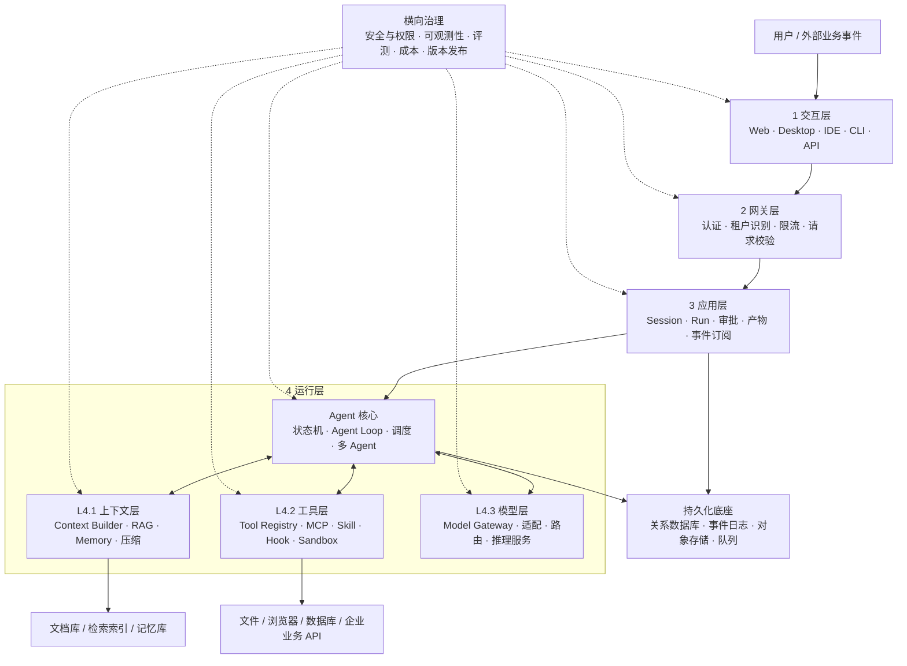
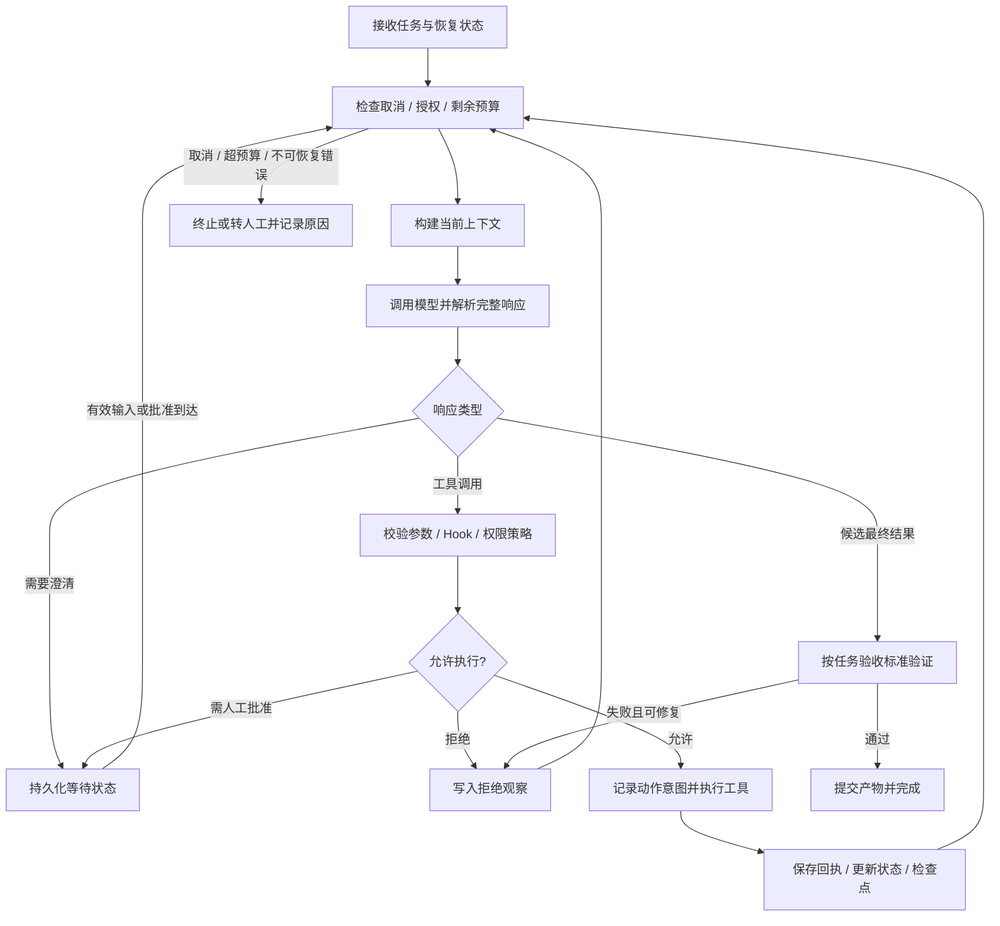
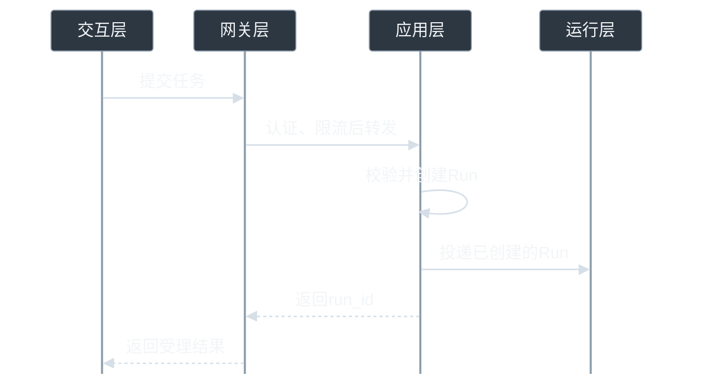
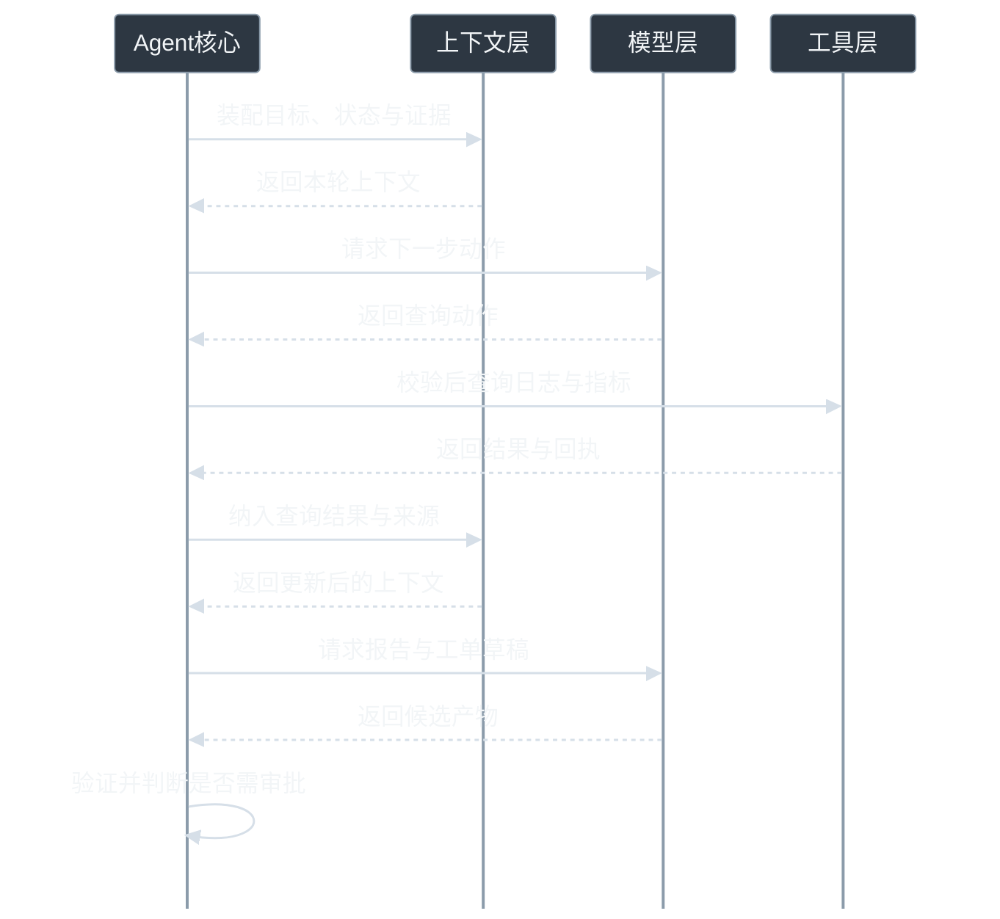
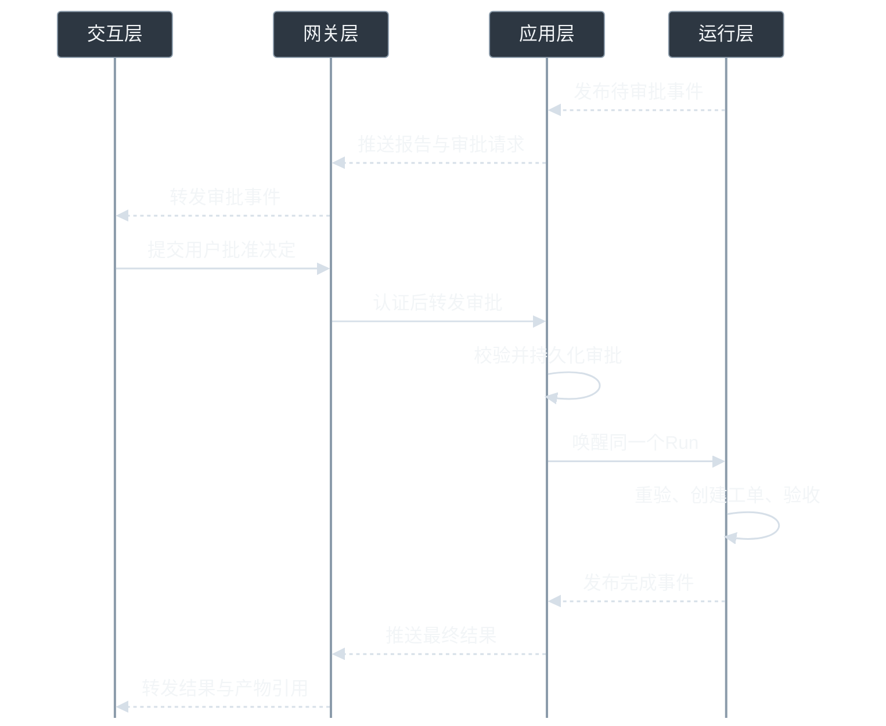

# AI 应用 Harness 完整架构：面试系统设计版

> 整理日期：2026-09-30。定位：AI 应用工程师、Agent 开发工程师、大模型应用后端与架构岗位。本文参考 Claude Code、Codex 的公开机制，提出一套可实现的通用架构。除明确引用的产品机制外，分层、接口、数据模型、阈值和部署方案均为本文的设计建议，不代表厂商内部实现，也不是已经完成的项目业绩。

## 1. 面试开场：先定义要解决的问题

我把 Harness 定义为围绕模型工作的运行与治理系统：它负责接收任务、维护状态、组织上下文、调用模型和工具、执行权限检查、处理失败、验证结果，并把过程和产物交付给用户。模型决定下一步候选动作，Harness 决定动作能否执行、如何执行、如何记录以及何时停止。

Claude Code 的官方说明将工作过程概括为收集上下文、采取行动、验证结果，并把提供工具与管理上下文的外围系统称为 Harness。[Claude Code 工作原理](https://code.claude.com/docs/en/how-claude-code-works)

面试中先约定业务：设计一个企业工作助手，支持知识问答、文档生成、数据分析、代码修改和业务系统操作；支持 Web、桌面、IDE、CLI；简单任务几秒内返回，复杂任务异步运行并可恢复。涉及外部写操作时，按企业权限和用户授权执行。

### 1.1 需求与成功标准

| 维度 | 必须回答的问题 | 本方案的设计 |
|---|---|---|
| 业务结果 | 到底帮用户完成什么 | 可验证的答案、文件、代码变更或业务动作 |
| 交互 | 用户怎样知道系统在工作 | 流式文本、阶段进度、工具状态、审批卡片、产物预览 |
| 长任务 | 页面关闭或 Worker 重启怎么办 | 任务状态持久化，客户端重连，检查点恢复 |
| 安全 | 模型犯错会造成什么影响 | 服务端鉴权、最小权限、沙箱、外部动作确认与审计 |
| 质量 | 如何证明比原方案更好 | 固定评测集、任务成功率、错误分类、线上反馈 |
| 成本 | 是否值得使用 Agent | 每个成功任务的总成本与人工节省时间 |
| 扩展 | 如何接入新能力 | 工具注册、MCP 适配、Skill 包、Hook 扩展点 |

容量、延迟和成功率必须先作为目标提出，再通过压测与评测验证。面试中不能把设计目标描述成已经达到的指标。

### 1.2 术语边界

| 概念 | 含义 | 与其他模块的关系 |
|---|---|---|
| Model | 生成文本、结构化输出或工具调用的模型 | 是被 Harness 调用的推理能力 |
| Agent | 在目标约束下，根据观察选择动作并迭代的执行主体 | 通常由模型、指令、工具权限和运行状态组成 |
| Harness | 让 Agent 持续、可控、可观测地工作的运行系统 | 包含循环、上下文、工具执行、状态和治理 |
| Workflow | 由程序定义的步骤和分支 | 可包围 Agent，也可作为 Agent 的一种工具 |
| Framework / SDK | 提供开发抽象和代码组件 | 能帮助实现 Harness，但不能替代业务治理 |
| RAG | 在生成前或过程中检索外部证据 | 是上下文供给路径，可供 Agent 调用 |
| Memory | 跨步骤或跨会话保存并再次使用的信息 | 需要来源、作用域、更新和删除机制 |
| Skill | 可复用的工作说明、资源和可选脚本 | 描述如何完成一类任务，不自动获得权限 |
| Tool | 可执行能力及其输入输出契约 | 真正访问数据或产生外部副作用 |
| Hook | 生命周期事件触发的扩展逻辑 | 用于校验、记录、转换或通知 |
| MCP | 工具和上下文能力的接入协议 | 不负责整个 Agent 的调度与业务安全 |

## 2. 总体架构：4 个主层 + 运行层内部 3 个子层 + 横向治理

系统由 **交互层、网关层、应用层、运行层** 四个主层构成。运行层内部包含 **上下文层、工具层、模型层** 三个子层，由 Agent 核心统一编排。交互层负责多端交互，网关层负责接入治理，应用层管理会话与业务任务，运行层负责 Agent 的完整执行过程。

上下文层、工具层和模型层属于运行层，三个子层之间是并列协作关系，由 Agent 核心按需调用。本文用 L1–L4 标记四个主层，用 L4.1–L4.3 标记运行层内部的三个子层。逻辑分层不等于部署边界；小团队可以先在模块化单体中实现。


*图 1：沿交互层、网关层、应用层进入运行层。运行层边框内包含 Agent 核心及上下文层、工具层、模型层；双向箭头表示 Agent 核心与三个子层之间的调用及反馈。持久化底座与横向治理服务于整个系统。*



### 2.1 分层职责与边界

| 层级 | 核心职责 | 主要输入与输出 | 面试官会追问 |
|---|---|---|---|
| L1 交互层 | 多端体验、附件、实时反馈、人工介入 | 用户意图 → 标准请求；事件 → UI | 断线怎么恢复？用户中途修改要求怎么办？ |
| L2 网关层 | 认证、限流、配额、路由、请求规范 | 外部请求 → 可信身份上下文 | 为什么只限制 QPS 不够？ |
| L3 应用层 | 会话历史、任务生命周期、业务配置、产物 | 请求 → Run；Run → 状态与结果 | 会话、一次任务和一次模型调用是什么关系？ |
| L4 运行层 | Agent 核心编排三个子层，负责执行闭环、状态机、恢复、停止、多 Agent | 目标与状态 → 受控执行过程与任务结果 | 如何防止死循环和重复执行？ |
| L4.1 上下文层（运行层内部） | 检索、记忆、信息筛选、预算与压缩 | 当前任务 → 本轮模型上下文 | 压缩后如何避免丢失约束？ |
| L4.2 工具层（运行层内部） | 工具发现、参数校验、权限、执行隔离 | 动作意图 → 执行结果与副作用记录 | 模型有工具名就能调用吗？ |
| L4.3 模型层（运行层内部） | 多模型适配、路由、流式解析、计费 | 统一模型请求 → 标准化模型事件 | 切换供应商会不会破坏语义？ |

### 2.2 三个平面

- **执行平面**：运行中的请求、上下文装配、模型调用、工具执行与事件输出。
- **控制平面**：发布 Agent 配置、工具与 Skill 版本、权限策略、模型路由和预算规则。
- **数据与证据平面**：会话、任务状态、工具回执、知识与记忆、产物、评测结果和审计记录。

运行中的任务绑定配置快照，避免管理员修改提示词或工具 Schema 后，任务前后使用了不同定义而无法复盘。紧急撤权仍必须实时生效，不能被旧快照保留。

## 3. 参考 Claude Code 与 Codex：借鉴什么

| 公开机制 | 可借鉴的设计 | 不应作出的推断 |
|---|---|---|
| Claude Code 的上下文—行动—验证循环 | 明确观察、执行、验收和停止条件 | 不能推断其完整内部微服务架构 |
| Codex App Server 的会话和事件接口 | 客户端与 Agent 核心解耦，使用结构化事件 | 本方案 REST/SSE 接口不等于 Codex 原生协议 |
| 两者的 Skills | 先发现描述，再按需加载工作说明 | Skill 文件不能替代服务端权限检查 |
| 子 Agent 的独立上下文 | 隔离探索噪声，以交付物回传结果 | 多 Agent 不必然提高质量或降低成本 |
| 长任务中的外部状态与验证 | 保存进度、产物与验收证据 | 摘要不能保证无损恢复，也不能回滚远程副作用 |

Codex App Server 文档公开了面向客户端的双向协议、会话操作与流式事件，适合作为“交互界面与运行内核分离”的参考。实际使用时需检查所选接口和传输的成熟度。[Codex App Server](https://learn.chatgpt.com/docs/app-server)

Skills 的按需加载与子 Agent 上下文隔离有明确的官方说明。[Codex Skills](https://learn.chatgpt.com/docs/build-skills)、[Codex Subagents](https://learn.chatgpt.com/docs/agent-configuration/subagents)

## 4. L1：交互层

### 4.1 输入统一化

支持文本、图片、文件、选中代码、当前工作区和业务事件。客户端负责采集，服务端负责校验；浏览器上传的 tenant_id、文件路径、权限声明不能直接信任。

建议统一请求字段：request_id、session_id、用户输入、附件引用、界面位置、期望输出类型、任务模式、客户端幂等键。身份、租户、可访问资源范围由服务端认证上下文补充。

附件先进入对象存储，完成类型、大小和恶意内容检查，再产生可访问的资源 ID。模型上下文使用解析后的相关片段，避免直接注入整份超大文件。

### 4.2 流式体验

至少区分五类界面状态：已接收、排队中、执行中、等待用户、已结束。执行中展示真实阶段，例如“检索知识库”“运行测试”，不要生成虚假完成百分比。

普通 Web 场景可用 HTTP 提交任务 + SSE 订阅事件；需要持续双向控制时可选 WebSocket。重连携带事件游标，服务端补发持久化事件或返回状态快照。客户端按 event_id 去重。

Token 增量属于展示数据；任务完成、工具回执和审批请求属于业务事件。可以对增量文本做批量持久化，而对关键状态转移立即持久化，降低存储放大。

### 4.3 中途干预

用户补充要求进入任务邮箱，在安全边界合并；取消请求设置取消标志并传播到子任务。取消已经发出的远程操作可能只能尽力而为，界面必须区分“已请求取消”和“已确认停止”。

审批卡片展示具体目标、参数、影响范围、有效期及可审查的变更。批准绑定动作摘要与版本；参数变更后重新判断授权，避免审批一个操作却执行另一个。

### 4.4 用户可选择权限模式

每次工具调用都询问用户会打断工作。产品可以提供权限模式，由用户在任务开始前选择，并允许针对当前任务明确授权一组操作。以下是本方案的产品设计建议，不是 Claude Code 或 Codex 的实际选项定义。

| 模式 | 访问与操作范围 | 什么时候询问用户 |
|---|---|---|
| 只读 | 读取已授权资料，查询数据，生成并展示回答或预览 | 禁止外部写入；要执行写操作需先调整授权范围 |
| 写入确认 | 在允许范围内读取、查询，准备写操作草稿 | 未被具体预授权的写操作执行前确认 |
| 自动执行 | 在用户预先授权的资源和动作范围内自动执行 | 需要扩大用户授权范围或策略要求确认时询问；本来无权执行的动作直接拒绝 |
| 完全访问 | 覆盖用户有权且明确授予的更广资源与操作范围 | 可同时选择免逐次确认；用户明确要求确认或组织强制审批的动作仍需要批准 |

“完全访问”描述访问范围，“免逐次确认”描述审批策略，底层应分开配置。可以用 `access_profile` 表达只读、工作区或已授权的完整范围，用 `approval_policy` 表达写入确认、边界确认或免逐次确认。“完整范围”仍以当前身份和业务权限为上限；即使免询问，参数校验、资源鉴权、预算、幂等与结果验收也照常执行。

这两个设置按层协作：交互层展示模式选择；应用层校验用户可选范围并绑定任务的授权与审批策略；运行层在每个具体动作前计算是否允许、是否需要确认，工具层落实执行检查。网关层负责认证与接入，客户端上传的模式不能直接成为执行权限。子 Agent 获得父任务允许委派的权限子集。

例如“自动分析故障，允许在项目 A 中创建普通工单”可以预授权该范围内的创建动作，减少弹窗；“分析故障，创建工单前让我确认”则保留这一步确认，即使当前界面选择了自动执行。明确的任务限制需要用户主动修改，不能被宽泛的模式选项覆盖。

## 5. L2：网关层

网关负责身份认证、租户识别、请求体校验、附件引用授权、限流、配额、请求追踪及业务路由。它不能代替工具执行前的资源鉴权：用户登录成功，不代表有权访问任意文档或执行任意业务操作。

需要区分三种网关：API Gateway 管用户与请求；Model Gateway 管模型供应商、模型能力和模型配额；Tool Gateway 管工具身份、权限与执行治理。它们可部署在同一服务中，但职责不能混淆。

### 5.1 限流不只看 QPS

一个用户请求可能触发多轮模型和工具调用。准入控制应同时限制：租户活跃 Run 数、模型 RPM/TPM、并行工具数、单任务预算、沙箱数与队列长度。

高负载时先做公平排队和背压；可把可接受延迟的任务转异步，或在质量门槛允许时降级模型。不能把所有失败立即重试，否则会形成重试风暴。

### 5.2 身份传播

使用服务端生成的 ExecutionContext 传递 tenant_id、user_id、run_id、授权资源范围和策略版本。工具端再次验证。第三方凭证存入密钥系统，使用短期或受限凭证，避免进入 Prompt、事件正文和普通日志。

## 6. L3：应用层

### 6.1 先分清五个对象

| 对象 | 生命周期与职责 | 示例 |
|---|---|---|
| Session / Thread | 用户可连续交互的会话容器 | 某个项目的工作对话 |
| Turn | 一次用户输入引发的交互回合 | “请分析这次故障” |
| Run | 可调度、可恢复、可计费的一次执行 | 故障分析任务，可包含多个步骤和子任务 |
| Step | 一次有明确边界的执行阶段 | 检索日志、模型决策、生成报告 |
| ToolCall | 一次具体工具调用记录 | 查询某时间范围的错误日志 |

这些是本方案的业务对象；不同 SDK 对 run、turn、session 的定义可能不同，应在适配层映射。一次模型请求既不等于一个用户任务，也不等于完整 Agent。

### 6.2 建议接口

```text
POST /sessions                  创建会话
POST /sessions/{id}/runs         提交任务，返回 run_id
GET  /runs/{id}                  获取任务快照
GET  /runs/{id}/events?after=...  订阅或补发事件
POST /runs/{id}/messages         补充信息与修改要求
POST /runs/{id}/cancel           请求取消
POST /approvals/{id}/decision    提交批准或拒绝
GET  /artifacts/{id}             下载或预览产物
```

长任务返回 202 和 run_id，不把 HTTP 连接当成任务本体。所有资源查询、下载和事件订阅都检查租户及资源权限，避免仅凭可猜测的 ID 访问他人内容。

### 6.3 数据模型

| 表/集合 | 关键字段 | 关键约束 |
|---|---|---|
| sessions | id、tenant_id、owner_id、project_id、created_at | 租户与所有者隔离 |
| runs | id、session_id、status、version、config_snapshot、budget、lease_epoch | 乐观锁；同一 Run 的协调写入有唯一所有者 |
| steps | id、run_id、type、status、input_ref、output_ref、attempt | 步骤与重试历史可追溯 |
| tool_calls | id、run_id、logical_action_id、args_hash、status、receipt_ref | 同一逻辑动作的重试沿用幂等身份 |
| approvals | id、action_digest、scope、expires_at、decision、approver | 审批与准确动作绑定 |
| events | run_id、sequence、event_id、type、payload_ref | Run 内序号唯一，消费者可去重 |
| checkpoints | run_id、sequence、state_ref、schema_version | 保存可恢复状态及格式版本 |
| artifacts | id、tenant_id、uri、hash、mime_type、provenance | 内容完整性与下载权限 |

数据库保存索引和状态，大日志、原始文件和产物进入对象存储。消息队列用于投递工作，数据库才是任务状态的事实来源；队列丢失后应能扫描未完成记录重新投递。

## 7. L4：运行层

运行层包含 Agent 核心和三个内部子层：L4.1 上下文层、L4.2 工具层、L4.3 模型层。Agent 核心负责循环与调度，上下文层供给本轮输入，模型层生成候选动作，工具层受控执行；它们协作完成任务。后续上下文、记忆、知识、工具扩展、多 Agent 与模型章节分别展开这些内部职责。

### 7.1 核心执行闭环


*图 2：工具调用走下方反馈循环，候选结果走右侧业务验收。需要审批时，任务先持久化等待，收到有效批准并重新校验后才执行。下方 Mermaid 展开了详细分支。*



OpenAI 的工具调用文档明确区分模型提出调用与应用执行函数：应用执行后将结果交回模型，模型再回答或继续调用。生产 Harness 在这个闭环中增加权限、持久化、预算与验证。[Function calling](https://developers.openai.com/api/docs/guides/function-calling)

### 7.2 状态机

任务级状态建议：QUEUED、RUNNING、WAITING_INPUT、WAITING_APPROVAL、SUCCEEDED、FAILED、CANCELLED、BUDGET_EXHAUSTED。步骤级另记录模型调用中、工具执行中、验证中等细粒度状态。

状态转移必须经服务端状态机，并使用版本号或事务校验。重复的批准回调、超时回调、队列消息不能让终态任务重新执行。用户再次尝试通常创建新 Run，并引用旧 Run 作为恢复来源。

### 7.3 用确定性程序包围模型决策

模型可以提出计划、选择工具、生成参数和判断是否需要更多信息。身份验证、预算扣减、状态转移、工具白名单和业务不变量由代码决定。

例如退款任务中，模型可以解释原因并建议金额；订单归属、可退余额、重复退款校验和资金提交必须由业务服务执行。自然语言“用户已经同意”不是可信批准凭证。

### 7.4 计划、执行、验证的关系

简单问答不必先调用独立 Planner；固定审批流程用 Workflow；开放式调查允许模型动态规划。复杂任务可以保存结构化计划，每个节点包含依赖、输入、交付物、验收条件和预算。

计划应允许根据观察修订，但保留目标和约束。验收不能只问模型“完成了吗”：代码任务看测试与变更，数据任务看计算与数据来源，文档任务看内容覆盖和文件可读性，业务动作看外部回执。

### 7.5 停止条件与循环检测

- 限制总步数、总 Token、墙钟时间、并发子任务和工具调用次数。
- 对“同一工具 + 规范化参数 + 相同结果”建立指纹，检测无进展重复。
- 对重复错误设置修复次数；错误不变时更换策略、请求缺失信息或失败退出。
- 对完成条件进行明确检查，避免完成后继续探索。
- 等待外部事件时释放 Worker，使用事件唤醒，避免不断调用模型询问“完成了吗”。

阈值按任务类型配置。设最大 30 步只能作为初始工程参数，必须用成功率和成本分布调整，不能作为所有 Agent 的通用答案。

### 7.6 调度与所有权

调度器领取 Run 租约并定期续约；数据库写入携带递增的 fencing token，拒绝旧 Worker 在失去租约后继续更新状态。任务队列通常提供至少一次投递，消费者要能处理重复。

外部系统未必支持 fencing，所以本地租约不能单独保证远程动作只发生一次。对外写操作仍需业务幂等键、执行台账、查询确认或补偿机制。

### 7.7 审批是条件分支

执行门根据当前身份、组织策略、任务授权范围、审批模式和具体动作返回三种决定：`ALLOW`、`ASK`、`DENY`。模式是策略输入，最终决定由服务端程序落实。

- `ALLOW`：动作在有效授权范围内且无需额外确认，直接受控执行。
- `ASK`：动作允许在获得当前用户的有效确认后执行，持久化待审动作并进入 `WAITING_APPROVAL`；批准后重新鉴权、核对动作版本再执行。
- `DENY`：动作被规则禁止或用户本身无权执行，停止该动作；不能用批准弹窗替代缺失的权限。

用户明确指定的确认步骤和组织强制审批仍需满足；其余动作根据模式及具体预授权决定是否询问。“自动执行”可通过限定项目、工具、动作类型、额度和有效期实现，不需要把全部操作都变成逐次批准。不存在等待审批时，任务从运行直接进入验收和交付。

## 8. L4.1：上下文层


*图 3：沿箭头看信息如何经过 Context Builder 进入本轮模型输入。检查点还负责恢复执行，长期记忆负责跨任务复用。*

### 8.1 本轮上下文是计算产物

上下文管理不是简单保留最近 N 条消息。Context Builder 根据当前目标、阶段、可用预算和权限，选择本轮需要的信息，并保留来源与版本。

建议装配项：系统与业务规则、当前用户目标、不可丢失约束、任务状态摘要、相关历史、检索证据、必要记忆、当前启用的工具定义、已选 Skill、最近动作与结果。

外部网页、文件和工具结果按数据处理。它们含有“忽略之前要求”等文字时，不应被提升为系统指令；摘要也必须保留其来源与不可信属性。

### 8.2 Token 预算

```text
可用输入预算 = 模型上下文上限 - 预留输出预算 - 安全余量
输入占用 = 指令 + 目标/约束 + 状态 + 历史 + 证据 + 工具定义 + Skill
```

用所选模型的 Token 估算方式计数，同时注意不同 API 对输出和推理预算的计量差异。不能只按字符串长度裁剪。

示例策略：固定规则与当前目标优先保留；随后保留最新观察和待处理动作；证据按相关性、可信度、时效性与去重结果筛选；过长工具输出保存全文引用并仅注入摘要。具体比例依任务评测决定。

### 8.3 四种减负方法

| 方法 | 适用场景 | 代价与风险 |
|---|---|---|
| 选择 | 只加载相关文件、证据和工具 | 召回不足可能丢掉关键事实 |
| 压缩 | 总结旧对话、提取任务状态 | 摘要会失真，需关联原文 |
| 外置 | 长日志、原始文档放对象存储 | 后续读取增加工具调用 |
| 隔离 | 子 Agent 处理独立探索 | 增加协调和汇总成本 |

Anthropic 的上下文工程文章讨论了压缩、结构化笔记和子 Agent 等方法。本文将它们进一步映射到可持久化、可追溯的应用组件。[Effective context engineering](https://www.anthropic.com/engineering/effective-context-engineering-for-ai-agents)

### 8.4 压缩如何避免破坏任务

维护单独的 TaskState，而不是只维护一段总结：目标、硬约束、用户已确认决策、未解决问题、进行中的动作 ID、产物引用、已验证结果和下一步。

压缩时保留最近的完整工具调用—结果配对，不能留下孤立 tool_result；不截断尚未解析完成的流式调用。压缩前后校验硬约束集合和待处理动作集合，摘要保留来源引用。高风险事实在使用前重新读取权威数据。

上下文压缩、任务检查点和长期记忆是三种不同机制：压缩减少本轮输入，检查点恢复执行，长期记忆跨任务复用。

### 8.5 缓存与上下文的取舍

稳定规则和可复用工具定义尽量保持稳定前缀，动态信息放后面。Prompt Cache 复用的是前缀计算，语义缓存复用的是历史答案，两者不能混称。压缩可能降低前缀命中率，但仍可能减少总成本，应比较完整任务成本。[Prompt caching](https://developers.openai.com/api/docs/guides/prompt-caching)

缓存命中不免除权限检查。答案缓存键应考虑租户、授权范围、数据版本、模型与提示词版本；涉及敏感业务数据时默认不跨授权域共享。

## 9. 记忆系统：保存什么、何时相信、何时忘记

### 9.1 分层记忆

| 类型 | 内容 | 建议存储 | 生命周期 |
|---|---|---|---|
| 工作状态 | 当前目标、计划、待执行动作 | 关系数据库/检查点 | 当前 Run |
| 会话记忆 | 历史消息与阶段摘要 | 消息表 + 对象存储 | 当前 Session |
| 用户记忆 | 明确偏好、稳定需求 | 结构化 KV/关系表，可附向量索引 | 跨会话，可编辑删除 |
| 项目记忆 | 约定、环境、已验证经验 | 项目文档 + 元数据索引 | 项目范围 |
| 情景记忆 | 某次任务发生了什么及结果 | 事件摘要与证据引用 | 按保留策略 |
| 程序性知识 | 经验证的流程与操作指南 | 版本化 Skill/流程仓库 | 审核发布后复用 |

向量数据库只是某种检索索引，不能替代记忆的权限、事实来源、事务与版本管理。

### 9.2 写入流程

候选提取 → 判断复用价值 → 过滤敏感内容与临时事实 → 检查来源 → 去重/冲突处理 → 根据策略自动保存或请求确认 → 建索引。

一个记忆条目建议包含：memory_id、tenant_id、scope、subject、content、source_refs、valid_from、valid_to、confidence、verification_status、version、created_by、last_verified_at。

模型自述不能自动变成事实。例如“测试应该通过”不能写成“测试已经通过”；应绑定真实测试回执。网页中的提示注入不能通过总结被“洗白”为用户偏好。

### 9.3 读取流程

先按租户和作用域过滤，再按当前任务检索；结合相关性、时效性、可信度和成本排序。读取结果附时间与来源，并标记已过期或待验证内容。用户当前明确要求优先于旧的个人偏好，但仍受企业权限与安全策略约束。

### 9.4 更新、冲突和遗忘

对稳定偏好采用版本更新；对可能变化的环境信息设置 TTL 或使用前重验；冲突记录保留来源，不能简单按最新文本覆盖权威事实。用户删除记忆时，处理主存储、检索索引、缓存和派生摘要，备份保留按产品政策管理。

Claude Code 官方将项目指令与自动记忆区分开来，适合用来说明“人为声明的约束”和“运行中积累的经验”不是同一种信息。[Claude Code memory](https://code.claude.com/docs/en/memory)

## 10. RAG 与知识服务

### 10.1 离线知识管道

数据接入 → 文档解析/OCR → 结构识别 → 去重与版本管理 → 按语义结构切块 → 元数据与 ACL 关联 → 稠密/稀疏索引 → 质量抽检。

表格应保留表头、单位和行列关系，代码保留符号与文件位置，制度文档保留章节、适用范围和生效日期。每个 chunk 关联原文版本与可定位位置，方便引用和撤回。

### 10.2 在线检索管道

问题理解 → 必要时改写/拆解 → 权限过滤下的多路召回 → 融合排序 → Rerank → 去重与证据选择 → 上下文装配 → 带来源回答。

BM25 适合关键词、编号与术语，向量召回适合语义表达；混合召回后用 RRF 或校准后的分数融合。Reranker 对候选进行更精细的相关性判断，但增加延迟。

对用户无权访问的内容，应在检索系统内部或候选读取前完成授权约束，并在使用/返回时再次校验；不能先把越权内容交给模型，再要求它不泄漏。撤权与删除事件应及时更新索引及缓存。

### 10.3 固定 RAG 与 Agentic RAG

固定 RAG 适合单次可回答的知识问答；Agentic RAG 允许根据缺失证据继续检索、改写问题或切换数据源。后者需要额外预算、停止条件和证据去重，不能无限搜索。

Contextual Retrieval 通过给片段补充文档背景改善检索，是可以验证的候选优化方案；不能把厂商在特定数据集上的收益直接当成自己的结果。[Anthropic Contextual Retrieval](https://www.anthropic.com/engineering/contextual-retrieval)

### 10.4 质量诊断

分别测解析正确率、Recall@k、排序质量、证据充分性、答案忠实度、引用正确率和拒答合理性。检索不到、检索到了但被裁掉、证据已过期、模型误读，是不同问题，不能统一用“换更强模型”解决。

## 11. L4.2：工具层


*图 4：先记住四张卡片的职责，再沿底部流程理解一次调用。Skill 指导方法，Tool 执行动作，MCP 连接能力，Hook 响应生命周期事件。*

### 11.1 工具注册中心

工具定义至少包含名称、用途与禁用场景、输入/输出 Schema、版本、超时、权限范围、副作用等级、幂等支持、并发约束和错误分类。工具名称使用业务语义，例如 `get_order`、`prepare_refund`、`commit_refund`，避免只有一个权限过大的 `execute_anything`。

模型看见的是经过权限与任务筛选的工具集合。工具很多时先检索名称与描述，再加载候选 Schema；注册中心仍需在真正执行时核验工具存在、版本与授权。

### 11.2 工具调用执行链

```text
接收完整 tool call
→ 关联 call_id 与当前 Run
→ 校验工具名称、版本、参数 Schema
→ 执行受信的参数规范化和前置 Hook
→ 对最终参数重新校验并执行权限/风险策略
→ 必要时绑定具体动作请求批准
→ 持久化动作意图与逻辑幂等身份
→ 获取隔离执行环境和受限凭证
→ 调用目标系统
→ 保存回执，更新执行台账
→ 运行后置 Hook，整理模型可见结果
```

流式生成的 JSON 尚未结束时不能提前执行写操作。Schema 正确仅说明结构符合契约，订单归属、金额上限、文件路径等业务语义还需要独立校验。[Structured outputs](https://developers.openai.com/api/docs/guides/structured-outputs)

### 11.3 工具错误分类

| 类别 | 例子 | 处理 |
|---|---|---|
| 可重试基础设施错误 | 429、暂时网络故障 | 在总预算内指数退避加抖动，遵循 Retry-After |
| 参数错误 | 缺字段、非法枚举 | 返回明确反馈，允许有限次数修正 |
| 权限错误 | 无权访问项目 | 停止该动作，不通过反复改写绕过 |
| 业务冲突 | 订单已关闭、资源版本变化 | 重新读取状态，重新规划或请求确认 |
| 结果未知 | 写操作请求超时但可能已生效 | 查询回执或幂等重试，不能盲目再次提交 |
| 不可恢复错误 | 不支持的能力、资源永久不存在 | 明确失败或转人工 |

返回模型的错误要能指导下一步，同时避免暴露凭证和内部敏感堆栈。完整诊断信息留在受控日志中。

### 11.4 MCP 的位置

MCP Host 是 AI 应用，Host 管理 Client，Client 连接 Server，Server 提供工具、资源或提示模板。模型提出工具调用后，由 Harness 中的适配器转成 MCP 请求，再把结果映射回模型可理解的格式。[MCP 架构](https://modelcontextprotocol.io/docs/learn/architecture)

MCP 解决连接契约与能力发现。它不自动解决租户隔离、业务授权、任务检查点、模型选型或副作用幂等。协议版本和 SDK 应锁定并做兼容测试，面试不要把某一版本的初始化或传输细节当成永久规则。

对外部 Server 的名称、描述、返回内容保持来源记录；对工具变更重新检查信任与权限。认证后的服务器也可能返回恶意或错误内容。[MCP 安全实践](https://modelcontextprotocol.io/specification/latest/basic/security_best_practices)

### 11.5 沙箱与执行环境

文件、Shell、浏览器、代码解释器使用按任务或租户隔离的执行环境，限制文件系统、网络出口、CPU、内存、磁盘、进程数和执行时间。容器隔离强度要与威胁模型匹配，高风险不可信代码可采用更强隔离。

凭证通过受控代理或短期授权访问，不把主账户密钥复制到工作区。产物从临时环境导出到持久化存储后再释放沙箱。恢复任务前检查环境版本、工作区状态和产物是否齐全。

## 12. Skill 系统

### 12.1 Skill 是可版本化的工作方法

一个 Skill 可以包含 `SKILL.md`、参考资料、模板、示例和可选脚本。比如“生成周报”定义信息来源、内容结构、校验规则与输出模板；底层查询和文件生成仍由工具执行。

Claude Code 与 Codex 都公开了按需加载 Skill 的机制。本文进一步建议为生产系统补充注册、审批、版本锁定、评测和撤回流程。[Claude Code Skills](https://code.claude.com/docs/en/skills)

### 12.2 生命周期

发布 → 静态检查 → 试运行评测 → 审核与签名/哈希固定 → 注册 → 发现 → 选择 → 加载 → 执行 → 记录使用效果 → 升级或回滚。

Skill 注册元数据建议包含：id、version、description、适用任务、输入输出契约、资源依赖、兼容模型、所需能力、维护者与可信来源。这里的扩展字段是本方案自定义元数据，不保证直接被任何现有客户端识别。

### 12.3 选择与权限

显式选择优先于自动发现；自动匹配结合任务意图和适用条件，避免仅因关键词相同就加载。先筛选用户有权使用的 Skill，再把少量描述交给模型。多个 Skill 冲突时按产品配置和任务目标解决，无法兼容就停止组合。

Skill 可以申请需要的能力，但实际权限取用户授权、企业策略、运行环境与工具权限的交集。Skill 中写“直接删除生产数据”不能突破工具执行层的授权规则。

### 12.4 Skill 与工作流的区别

需要表达经验、允许灵活判断的任务适合 Skill；必须精确执行审批顺序、金额计算和状态转移的步骤适合确定性 Workflow。可以由 Skill 指导整体工作，再调用严格工作流完成关键动作。

## 13. Hook 系统

### 13.1 事件驱动扩展

Hook 在生命周期节点自动触发。本文建议的通用事件包括：RunStarted、BeforeContextBuild、BeforeModelCall、BeforeToolExecute、AfterToolExecute、BeforeCheckpoint、BeforeComplete、RunFailed。它们是本方案事件名，不等同于 Claude Code 或 Codex 的配置字段。

Claude Code 官方提供 PreToolUse 等事件；不同事件的阻断能力不同，例如动作完成后的 Hook 不能阻止已经发生的副作用。[Claude Code Hooks](https://code.claude.com/docs/en/hooks)

### 13.2 三类 Hook

| 类型 | 示例 | 失败策略 |
|---|---|---|
| 必须通过的同步校验 | 输出格式、动作前置条件、敏感数据检查 | 超时或失败则阻断对应操作，并记录原因 |
| 有限的同步转换 | 参数规范化、补充受信业务字段 | 转换后重新做 Schema 与权限校验 |
| 异步观察 | 指标、通知、使用统计 | 重试或进入死信队列，通常不阻塞主任务 |

权限引擎是强制执行点，不能仅作为可被用户关闭的普通 Hook。Hook 的 allow 结果不能覆盖企业 deny。模型型审核器可提供信号，但不能成为资金、身份和资源权限的唯一判断依据。

### 13.3 防止扩展机制自身失控

限制 Hook 时长、输出大小和调用深度；为事件提供稳定 ID，异步消费者去重。记录触发来源，避免 Hook 产生新事件后无限递归。Hook 版本与任务配置一起固定，并为失败率设置告警。

## 14. 多 Agent：独立分工与受控汇总


*图 5：蓝色箭头分配任务，橙色箭头回传结论、证据与产物。分支能否并行由依赖决定；验证任务要等待相关产物就绪。*

### 14.1 什么时候值得使用

适合：多个独立资料方向、可分离模块、需要不同工具集的专业任务、探索输出非常长的任务。不适合：简单问答、强顺序依赖、多个 Agent 必须反复修改同一资源的工作。

Anthropic 的研究系统公开采用主 Agent 协调并行子 Agent 的方式，同时讨论了协调复杂度与 Token 成本。它说明多 Agent 有适用条件，不能推出所有业务都应该多 Agent 化。[Multi-agent research system](https://www.anthropic.com/engineering/multi-agent-research-system)

### 14.2 默认采用主控—工作者结构

主控负责目标、拆分、预算、依赖、汇总与最终验收；子 Agent 负责边界明确的交付物。初期避免所有 Agent 互相自由发送消息，减少不可追踪的沟通和循环。

每个子任务必须说明：目标、范围、已知信息、禁止修改项、可用工具、权限、预算、截止时间、交付格式和验收条件。子 Agent 的权限不得高于父任务的委派权限，预算从全局预算中预留。

### 14.3 共享什么、隔离什么

共享目标与关键约束、任务注册表和产物引用；隔离工作上下文、临时文件和执行日志。主控接收结论、证据、产物、风险和未完成项，必要时再展开原始日志。

共享事实通过结构化存储维护版本和来源。代码任务优先独立 worktree/分支，定义文件所有权；主控合并后做集成验证。两个 Agent 都说“测试通过”不等于合并结果通过。

### 14.4 调度与退出

使用 DAG 管依赖，限制最大扇出和递归深度。超时子任务可重派，但外部写动作按执行台账判断是否安全。父任务取消向下传播；所有子任务完成并不自动意味着父任务完成，仍需检查总目标覆盖。

等待子任务期间，主控进入可恢复等待状态，收到完成事件再继续。不要用不断唤醒主模型轮询的方式消耗预算。

### 14.5 验证是否有收益

在同一任务集、相同模型条件和可比预算下，对照单 Agent、多 Agent 与纯并行工具调用，比较成功率、总 Token、关键路径耗时、冲突率和人工接管率。必须把拆分与汇总开销算进去。

## 15. L4.3：模型层

### 15.1 统一适配接口

内部统一输入消息、工具定义、输出格式、预算与取消信号；输出统一为 text_delta、tool_call、usage、completed、error 等事件。保留供应商原始响应引用，便于排错。

适配器处理工具调用 ID、消息配对、多模态格式、流式片段拼接、拒绝/截断状态与使用量统计。不要把不同厂商所有能力压成最低公共子集；使用能力矩阵明确哪些功能可用。

### 15.2 路由与降级

先满足上下文、工具调用、结构化输出、数据地域和安全要求，再按任务难度、延迟与成本选择模型。简单分类可用小模型或规则，复杂规划与证据综合可升级模型。

回退模型前确认工具 Schema、输出契约、上下文长度和策略兼容。不能在一次远程写操作状态未知时，把同一个任务丢给另一模型重新执行。模型服务回退与业务动作重试要分开。

### 15.3 自部署推理

若业务要求私有部署，可在这一层使用推理服务并管理 GPU、批处理、KV Cache 与模型版本。是否自部署应比较真实吞吐、利用率、延迟、模型质量、运维成本与数据约束。

Prefix Cache 主要减少重复前缀的预填充计算，不能消除后续逐 Token 生成的成本。[vLLM Automatic Prefix Caching](https://docs.vllm.ai/en/latest/features/automatic_prefix_caching/)

## 16. 长任务、持久化与故障恢复

### 16.1 检查点保存哪些内容

保存任务状态、计划进度、当前上下文摘要引用、完整消息边界、待处理 ToolCall、外部操作回执、审批状态、已用预算、配置版本、子任务关系和产物引用。不能只保存对话文本。

事件日志用于记录事实，检查点用于加速恢复，当前状态表用于查询。关键状态更新与对应 outbox 事件在同一数据库事务中提交，后台投递 outbox，消费端去重。

LangGraph 的持久化与中断机制可作为实现参考，但使用检查点并不自动保证外部业务动作只执行一次。[LangGraph Persistence](https://docs.langchain.com/oss/python/langgraph/persistence)、[LangGraph Interrupts](https://docs.langchain.com/oss/python/langgraph/interrupts)

### 16.2 最难的崩溃窗口

假设“创建工单”在远程已成功，但 Worker 在保存结果前崩溃。本地只看到 EXECUTING，此时直接重做会产生重复工单。

处理顺序：预先持久化 logical_action_id → 调用时传业务幂等键 → 保存远程回执。恢复时使用同一逻辑动作身份查询或重试。远程既不支持幂等也不能查询时，标记 UNKNOWN 并对账或转人工，不能承诺严格 exactly-once。

同样参数不一定代表同一业务动作：用户可能真的要连续创建两个相同工单。幂等键应来自经过确认的逻辑动作身份，而不是永久以参数哈希去重。

### 16.3 恢复步骤

领取有效租约 → 读取最近兼容检查点 → 应用后续事件 → 核对未完成动作 → 重验当前权限和资源版本 → 恢复沙箱/产物 → 继续未完成步骤。

已确认成功的工具结果可复用；不可重复副作用不能随日志回放重做。确定性回放、使用录制结果的测试、重新调用模型的实验，应使用不同执行模式。

### 16.4 长时间工作为什么需要外部进度

跨多个上下文窗口时，明确的任务清单、当前工作状态与验收证据比单纯延长对话更可靠。Anthropic 的长任务 Harness 实践讨论了初始化、增量推进与可交接产物，本文用结构化 TaskState 和检查点承接这一思想。[Long-running harnesses](https://www.anthropic.com/engineering/effective-harnesses-for-long-running-agents)

## 17. 横向安全、可观测性与评测

### 17.1 安全控制分布在整条链路

| 边界 | 主要风险 | 控制方式 |
|---|---|---|
| 用户 → 应用 | 冒用身份、越权访问 | 认证、资源鉴权、租户过滤 |
| 数据 → 模型 | 提示注入、伪造来源 | 数据与指令分离、来源标记、敏感动作独立授权 |
| 模型 → 工具 | 错误参数、过度权限 | Schema、业务校验、最小工具集、策略引擎 |
| 工具 → 网络/文件 | 数据外传、任意代码执行 | 沙箱、出口策略、资源范围、凭证隔离 |
| Skill/Hook → 运行时 | 供应链与扩展代码风险 | 来源审查、版本固定、隔离、撤回机制 |
| Agent → Agent | 权限扩大、错误事实传播 | 委派权限交集、结构化交付、证据与验收 |
| 系统 → 用户 | 泄漏、虚假成功、危险链接 | 输出检查、产物权限、真实回执、来源校验 |

不要宣称一句“忽略恶意指令”就能解决 Prompt Injection。核心目标是让不可信内容即使影响了模型，也不能直接取得本不拥有的操作权限。

### 17.2 可观测性

以 trace_id 串起 session_id、run_id、step_id、tool_call_id 和子任务。记录模型/提示词/工具版本、检索文档版本、耗时、Token、缓存使用量、重试原因、策略决定和产物位置。

日志、指标与 Trace 分工明确：日志看具体错误；指标看整体趋势；Trace 看单个任务关键路径。敏感正文采用脱敏、分级访问、采样与保留策略，不默认把所有 Prompt 明文写入通用日志。

展示给用户的是可验证的工作进度、动作与理由摘要；系统调试依靠输入输出、状态转移和证据，不依赖获取模型私有思维链。

### 17.3 评测体系

| 层次 | 评测对象 | 指标/方法 |
|---|---|---|
| 组件 | 检索、工具选择、参数、记忆读写 | Recall@k、参数有效率、记忆精度、误触发率 |
| 单任务 | 最终产物与业务结果 | 任务成功率、验收通过率、引用准确率 |
| 过程 | 工具与权限行为 | 无效调用率、越权尝试、重复动作、循环率 |
| 系统 | 延迟、稳定性、成本 | P50/P95、恢复成功率、每成功任务成本 |
| 安全 | 注入、越权、泄漏、危险执行 | 攻击成功率、误拦截率、人工复核 |
| 产品 | 用户是否完成业务 | 采用率、人工接管率、返工率、满意度 |

构建正常、边界、故障与对抗样本；分开开发集和留出测试集，避免反复根据同一测试集调提示词。规则校验与真实业务断言优先，开放式质量再结合人审和校准后的 LLM Judge。

模型、Prompt、Skill、检索策略和工具描述变化都可能改变行为，应进入回归评测。线上反馈形成新样本，经脱敏与标注后补入评测集。[Evaluation best practices](https://developers.openai.com/api/docs/guides/evaluation-best-practices)

### 17.4 发布与回滚

把模型、提示模板、工具 Schema、Skill/Hook、检索配置组成可追踪版本。发布顺序是离线评测 → 影子评测或小范围试用 → 灰度 → 扩大流量。写操作不能在影子流量中真实重复执行，应使用录制结果、只读模式或测试环境。

退化时回滚配置与路由，并保留现场；进行中的任务按原快照完成或受控迁移，涉及安全撤权则立即中止相关能力。

## 18. 性能、成本和容量估算

### 18.1 先找关键路径

```text
任务总耗时 ≈ 排队 + 上下文准备 + 各串行步骤耗时 + 并行步骤关键路径 + 验收与交付
```

分别测 API 确认时间、首个有效进度时间、首 Token 时间和完整任务时间。流式输出改善感知等待，不等于缩短任务完成时间。优化通常从减少不必要模型轮次、减少生成量、并行独立 I/O、复用检索和前缀计算开始。[Latency optimization](https://developers.openai.com/api/docs/guides/latency-optimization)

### 18.2 一组可口算的假设

以下都是面试用假设，未经压测：每秒进入 5 个任务，平均持续 40 秒，每任务平均 6 次模型调用，每次平均输入 5,000 Token、输出 500 Token。

- 平均在途任务：Little 定律，L = λW = 5 × 40 = 200。
- 模型调用：5 × 6 = 30 次/秒，即 1,800 次/分钟。
- 输入吞吐：30 × 5,000 × 60 = 900 万 Token/分钟。
- 输出吞吐：30 × 500 × 60 = 90 万 Token/分钟。

这些是平均负载估算，还需考虑峰值、长尾、重试、不同模型配额和缓存计费。200 个在途任务不等于 200 个正在使用 CPU 的线程，也不等于 200 个同时进行的模型请求。模型并发应使用模型阶段的到达率与服务时间重新估算。

### 18.3 成本公式

```text
总任务成本 = Σ(未缓存输入 × 输入单价
              + 缓存写入 × 写入单价
              + 缓存读取 × 读取单价
              + 输出 × 输出单价)
            + 工具/API + 检索/重排 + 沙箱 + 存储 + 调度成本
每成功任务成本 = 同一统计窗口内所有尝试的总成本 / 成功任务数
```

计费分类按供应商规则去重，不重复计算缓存写入与普通输入；推理 Token 等费用按实际使用量口径归集。失败任务和子 Agent 的成本不能漏算。

### 18.4 预算控制

开始调用前预留预算，完成后按实际使用量结算；父子 Agent 共享总账，防止并发超卖预算。预算预留只是保守控制，供应商最终计费可能滞后，因此需要合理余量与对账。

业务优先级与租户公平性共同决定队列，不让少数超长任务占满模型和沙箱。保护交互任务的延迟，同时限制后台任务的资源占用。

## 19. 一次完整任务如何走通

场景：“查明上周订单失败率升高的原因，生成报告，并在我确认后创建修复工单。”

用户发起任务的入口链路是 **用户 → 交互层 → 网关层 → 应用层 → 运行层**。交互层采集要求并展示反馈，网关层处理认证与接入治理，应用层创建业务任务并绑定权限、配置和预算，运行层内的 Agent 核心协调上下文层、模型层和工具层完成执行。进度、审批请求与最终结果经应用层、网关层、交互层返回用户。

运行层内部的调用按任务需要组织，不要求每轮按固定顺序遍历全部组件。任务异步执行，事件流连接用于展示和控制，页面关闭或连接断开不代表任务终止。

**先区分层级关系与时间顺序。** 总架构图说明系统有哪些层、运行层包含哪些组件；下面三张时序图沿同一个业务任务，分阶段说明这些组件怎样协作。交互层、网关层、应用层、运行层是四个主层；上下文层、工具层、模型层都在运行层内部，Agent 核心负责协调它们。

**三张图通过同一个 run_id 衔接。** 假设应用层创建任务 `run_001`，图 A 将它交给运行层，图 B 展开这个运行层内部的调查过程，图 C 展示同一任务的审批、恢复与交付。图 C 中“唤醒任务”继续的是 `run_001`，审批本身不会创建新的调查任务。

| 图 | 观察范围 | 从哪里接上 | 交给下一阶段什么 |
|---|---|---|---|
| 图 A：提交任务 | 四个主层之间的入口调用 | 用户在交互层提交要求 | 持久化的 Run、输入引用、配置、授权范围和预算 |
| 图 B：执行调查 | 放大图 A 的“运行层” | Agent 核心取得图 A 投递的 Run | 报告、工单草稿、动作及模式判断；本例产生等待审批事件 |
| 图 C：按需审批与交付 | 回到四个主层之间的交互 | 图 B 产生的动作与审批判断 | 同一个 Run 的完成事件、最终报告与真实工单回执 |

本例的任务状态沿三图连续变化：图 A 创建 `QUEUED` 任务；图 B 执行时进入 `RUNNING`，需要用户批准时进入 `WAITING_APPROVAL`；图 C 收到有效批准后恢复为 `RUNNING`，执行及验收通过后进入 `SUCCEEDED`。调查过程中可以执行多轮模型与工具调用；不需要审批的任务可以直接进入结果交付。

时序图从上往下表示时间先后，实线箭头表示请求或指令，虚线箭头表示响应或事件反馈。图 A、图 C 中的 `R` 表示整个运行层；图 B 用 `P` 表示运行层内部的 Agent 核心，`C/M/T` 分别表示它内部的三个子层。

### 19.1 图 A：提交任务

用户在交互层输入要求并提交。入口经过网关层和应用层，再交给运行层异步执行。



应用层先持久化 Run、配置快照、模型策略与预算，再投递任务。交互层展示“已受理”并订阅事件；事件订阅和产物访问也要经过网关及应用层的权限检查。连接断开后按游标补发事件，任务仍可继续执行。

**图 A → 图 B：** 图 A 中的任务投递由运行层接收，运行层内的 Agent 核心加载同一个 Run 的目标、配置和状态，开始图 B 的内部执行。交互层收到的是任务已受理的回执，最终结果会在后续阶段返回。

### 19.2 图 B：执行调查

下图只展开运行层内部的四个组件：Agent 核心、上下文层、模型层和工具层。



每轮检查取消、时限、步数和剩余预算；模型层按应用层绑定的策略选择实际模型，工具层执行前校验参数与资源权限。Agent 核心保存真实工具结果、检查点和进度事件。报告与工单草稿验证后，执行门依据权限模式和具体动作决定：允许则执行，需确认则保存准确动作摘要并等待，禁止则停止该动作。本例因为用户要求创建前确认，进入等待审批状态。

**图 B 内部的关系：** 上下文层选择“本轮需要知道什么”，模型层生成“下一步候选动作”，工具层负责“这个动作能否执行以及真实结果是什么”。Agent 核心将这些能力组织成循环：装配上下文 → 获取模型决策 → 受控执行工具 → 纳入真实观察 → 再决策。模型层返回工具调用意图后，由 Agent 核心交给工具层执行。

**图 B → 图 C：** “返回候选产物”指模型生成的报告与工单草稿，此时工单尚未创建。Agent 核心检查报告证据与工单参数，并依据任务授权和业务策略判断是否需要用户批准。本例用户明确要求“在我确认后创建修复工单”，因此核心将创建动作、参数摘要和版本持久化，记录待审批请求并进入 `WAITING_APPROVAL`。图 C 的第一条“发布待审批事件”承接的是这个请求。应用层消费事件并组织审批详情，交互层展示报告与工单确认卡片。三个子层的内部调用无需重新经过用户入口网关，执行时仍受资源权限和预算约束。

### 19.3 图 C：按需审批与交付

运行层发出审批请求，用户决定沿入口链路回传。审批通过后，运行层执行受控写入，验收结果并交付。

**图 C 的审批部分是可选分支。** 下图画的是本例“需要确认”的路径。若用户已预授权创建普通工单，当前动作也满足组织和任务策略，就跳过询问、等待和唤醒这几步，直接从“重验、创建工单、验收”继续，随后照常发布完成事件。如果用户选择只读模式，则不创建工单，只交付报告或工单草稿。

**这里审批什么，为什么要审批？** 用户批准的是“按当前参数创建这张工单”这个业务动作。分析报告可以先展示给用户；创建工单会写入业务系统，而本例的任务要求将它放在用户确认之后。审批不能代替报告质量验证，也不能赋予用户原本没有的权限。

**待审批事件有什么作用？** 它把运行层的等待状态传给应用层，驱动用户界面展示可审查的动作详情与确认入口。事件引用 `run_id`、`approval_id`、动作摘要或版本、待审参数与报告引用，避免只弹出没有具体对象的“是否同意”。运行层保存状态后可以释放 Worker；用户决定持久化后再唤醒同一个 Run，核对批准的动作版本并继续执行。

**哪些任务需要这个阶段？** 审批由权限模式、已有预授权、任务要求与组织策略共同决定。普通问答、已授权的只读查询、报告生成通常直接交付；自动模式下已预授权的写操作也可以直接执行。需要当前用户批准的动作才进入等待审批。本例用户拒绝创建时，保留报告并结束创建动作；如果修改了待审参数，重新验证并绑定新版本的批准。



“重验、创建工单、验收”发生在运行层内部：Agent 核心读取审批记录，工具层重验当前权限与动作摘要，幂等创建工单；Agent 核心验证真实回执，保存最终产物与完成事件。应用层校验审批者、动作版本和有效期，产物查询仍执行资源鉴权。

**图 C 中的两次反馈：** 第一次反馈是报告与审批请求，让用户确认动作；用户批准后，运行层继续执行。第二次反馈是验收后的最终结果。网关转发事件，交互层根据事件展示确认卡片、报告和工单链接；“唤醒同一个 Run”与图 B 的内部循环使用相同的 Agent 核心和工具层。

为控制图的宽度，三张图均省略独立的存储参与者；任务、审批、检查点和事件仍需要持久化。图中推送表示应用层消费运行层已持久化的事件，再经网关转发给交互层。

### 19.4 各层如何交接，边界在哪里

| 交接关系 | 传递的内容 | 各自承担的职责 |
|---|---|---|
| 交互层 → 网关层 | 用户输入、附件引用、会话ID、请求ID，以及认证凭据 | 交互层采集意图；网关层认证、限流并校验请求。客户端填写的租户和权限声明不能直接信任 |
| 网关层 → 应用层 | 标准请求与服务端建立的可信身份上下文 | 网关层完成接入治理；应用层检查业务资源访问范围并建立任务 |
| 应用层 → 运行层 | run_id、目标、输入引用、配置快照、授权范围、预算与模型策略 | 应用层确定业务任务与约束；运行层管理执行循环、状态迁移、恢复和验收 |
| 运行层 → 应用层 | 带run_id的进度、待审批、完成或失败事件，以及产物引用 | 运行层记录真实执行事实；应用层提供用户可访问的事件与产物接口 |
| 应用层 → 网关层 → 交互层 | 已授权的状态、审批详情、报告与工单引用 | 应用层组织业务反馈，网关层转发，交互层负责展示及采集用户决定 |
| 用户批准 → 交互层 → 网关层 → 应用层 → 运行层 | 审批ID、动作版本、用户决定，以及持久化审批记录引用 | 应用层核验并保存批准；运行层读取批准并重验后继续执行 |

图中的应用层负责业务任务接口、资源访问规则和审批受理；Agent 核心负责执行状态迁移与检查点。两者使用统一的任务状态与事件记录，避免各维护一套相互矛盾的状态机。数据库中的持久化记录用于恢复与事件补发，队列或通知负责唤醒执行。

模型选择发生在运行层的模型层，依据应用层绑定的模型策略以及本轮能力要求执行；用户请求入口处的网关层负责接入治理。审批决定需要经过入口链路并持久化，工具层在执行前仍需重新验证当前权限与准确动作。

如果日志不足，报告区分已证实事实与假设；如果工具结果互相冲突，继续核实；如果用户拒绝创建，保留报告并结束该动作；如果创建请求超时，查询是否已创建，不能直接再建一张。

## 20. 部署方案与演进路线

### 20.1 第一版：模块化单体 + 独立 Worker

推荐起步组合：Web/API 服务、任务 Worker、PostgreSQL、对象存储、一个队列、基础检索索引、模型适配器和隔离工具执行器。Redis 可用于缓存、短期协调与限流，但关键任务状态持久化到数据库。

可使用 Python/FastAPI 或 TypeScript 服务实现；团队熟悉的 Java/Go 同样适合网关和任务后端。语言选择应服务于现有团队与工具生态，不构成架构的核心卖点。

### 20.2 框架选择

| 方案 | 适用情况 | 必须补的能力 |
|---|---|---|
| 自建轻量循环 | 流程简单、需要精确控制 | 状态、重试、审批、观测和测试 |
| Agent SDK | 希望复用循环、工具与交接抽象 | 业务权限、持久化策略、产品接口和评测 |
| 图式编排框架 | 有明确状态与分支，需要中断恢复 | 外部副作用幂等、生产存储、运维 |
| 持久化工作流引擎 | 长时间等待、复杂重试与跨服务协作 | 将模型调用和外部动作封装为可追踪活动 |

不要同时引入多套调度与状态系统却没有明确所有权。若组合工作流引擎和 Agent 图，应约定谁管理任务生命周期，谁管理单次推理子流程。

### 20.3 分阶段交付

1. **可用闭环**：单 Agent、少量工具、基本上下文、流式事件、产物与基础评测。
2. **可靠执行**：检查点、工具台账、审批、中断恢复、预算与故障注入。
3. **可扩展能力**：MCP、Skill/Hook 注册、知识治理、受控记忆。
4. **有证据的优化**：模型路由、上下文策略、缓存、按需要加入多 Agent。
5. **规模化运行**：租户公平调度、独立执行集群、灰度发布与持续评测。

### 20.4 建议模块目录

```text
app/
  interfaces/       多端API、事件流、审批和产物接口
  application/      Session、Run、业务用例
  runtime/          状态机、Agent Loop、调度、恢复
  context/          装配、压缩、检索、引用
  memory/           作用域、写入、召回、冲突、删除
  capabilities/     Tools、MCP、Skills、Hooks
  execution/        沙箱、凭证代理、动作台账
  models/           供应商适配、路由、流式解析、用量
  policy/           授权、风险策略、预算
  persistence/      数据库、事件、检查点、对象存储
  observability/    Trace、指标、日志
evals/
  datasets/         正常、边界、故障、对抗样本
  graders/          规则校验、业务断言、人审与模型裁判
  reports/          版本对照与回归结果
```

## 21. 面试讲述稿与架构答辩

### 21.1 90 秒讲述稿

“我会先明确这个 AI 应用是回答问题还是完成动作，以及允许的延迟、成本和权限范围。我把系统分为四个主层：交互层、网关层、应用层、运行层。运行层内部包含上下文层、工具层、模型层，由 Agent 核心统一编排。

核心是可持久化的 Agent Loop：每轮从任务状态构建上下文，模型提出下一步动作，执行层做参数与权限检查，再执行工具，把真实结果反馈给模型。完成时按业务验收条件检查，而不是只相信模型说完成。

上下文层负责选择本轮信息，其中的记忆模块负责跨任务复用；Skill 封装工作方法，Hook 接入生命周期，MCP 统一外部能力连接。多 Agent 只用于可以独立分工或需要隔离上下文的工作。

生产上我最关注三个问题：外部动作的幂等与未知结果处理、断点恢复时状态和权限的一致性、评测驱动的质量成本优化。初期用模块化单体加 Worker，先把这些边界做正确，再按实际瓶颈拆服务。”

### 21.2 面试官追问与答题抓手

| 追问 | 回答抓手 |
|---|---|
| 你画了很多层，是否过度设计 | 逻辑分层不等于微服务；第一版只保留必要部署单元 |
| 模型已经有长上下文，为何还要记忆 | 长度、成本、相关性、时效、跨会话生命周期是不同问题 |
| 用 LangGraph 不就解决了吗 | 框架帮助编排，业务授权、幂等、数据治理和评测仍归应用 |
| 任务崩溃怎么恢复 | 检查点加事件重建状态，先对账待处理动作，再继续 |
| 工具成功但响应丢了怎么办 | 同一逻辑动作幂等查询；无法确认则 UNKNOWN，不盲重试 |
| Hook 能否做所有安全逻辑 | 可做扩展检查，但不可绕过的权限执行点需要独立存在 |
| 多 Agent 有什么可测价值 | 在同等条件下测成功率、关键路径、成本和冲突率 |
| 如何证明上下文策略有效 | 同一任务集做消融，检查约束保留、答案质量和总成本 |
| 如何降低幻觉 | 检索与工具获取证据，结构化状态，验证与合理拒答 |
| 项目亮点在哪里 | 讲实际失败案例、定位证据、改动、对照结果与限制 |

### 21.3 十条容易失分的说法

1. “接上模型 API 就是完整 Agent 平台。”
2. “长期记忆就是把所有聊天放进向量库。”
3. “加一句禁止越权就安全了。”
4. “MCP 会自动处理业务权限。”
5. “工具报错重试三次就行。”
6. “有检查点就能回滚任何操作。”
7. “多 Agent 一定更智能。”
8. “JSON 合法说明答案正确。”
9. “模型说完成就是完成。”
10. “这些设计指标就是我的真实项目业绩。”

## 22. 阅读路线与来源说明

第一次按第 1—3 章建立整体概念，再精读第 7—16 章；面试前复习第 18—21 章。配套题库把这些模块展开为可口述回答和追问。

本文的事实引用优先使用官方文档；各链接已在本次整理时检索或打开。产品接口和默认行为可能变化，实际接入前应按版本重新核对。本文未声称复刻 Claude Code 或 Codex 未公开的内部架构。

核心来源索引：

- [Claude Code 工作原理](https://code.claude.com/docs/en/how-claude-code-works)：循环、工具与上下文。
- [Codex App Server](https://learn.chatgpt.com/docs/app-server)：客户端集成、会话与事件。
- [Building effective agents](https://www.anthropic.com/engineering/building-effective-agents)：Workflow 与 Agent 的选择。
- [Claude Code Skills](https://code.claude.com/docs/en/skills)、[Hooks](https://code.claude.com/docs/en/hooks)、[Subagents](https://code.claude.com/docs/en/sub-agents)：扩展机制。
- [Codex Skills](https://learn.chatgpt.com/docs/build-skills)、[Subagents](https://learn.chatgpt.com/docs/agent-configuration/subagents)：按需加载与上下文隔离。
- [MCP 架构](https://modelcontextprotocol.io/docs/learn/architecture)：协议职责。
- [上下文工程](https://www.anthropic.com/engineering/effective-context-engineering-for-ai-agents)、[长任务 Harness](https://www.anthropic.com/engineering/effective-harnesses-for-long-running-agents)：信息与进度管理。
- [OpenAI 评测实践](https://developers.openai.com/api/docs/guides/evaluation-best-practices)：持续评测。
