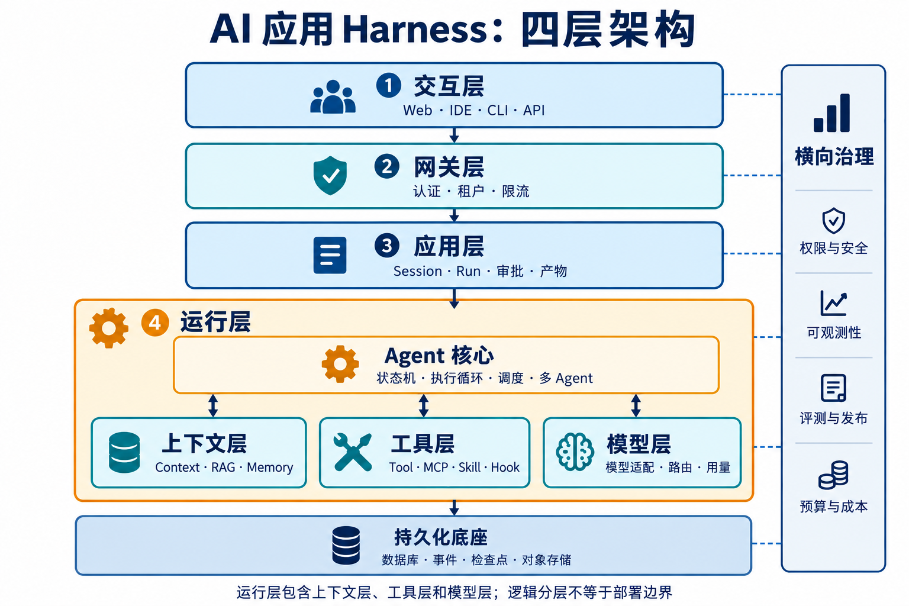
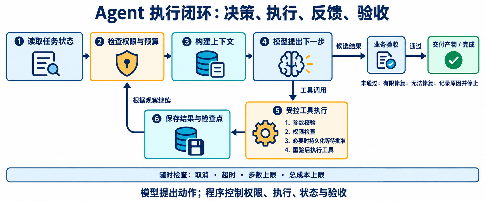
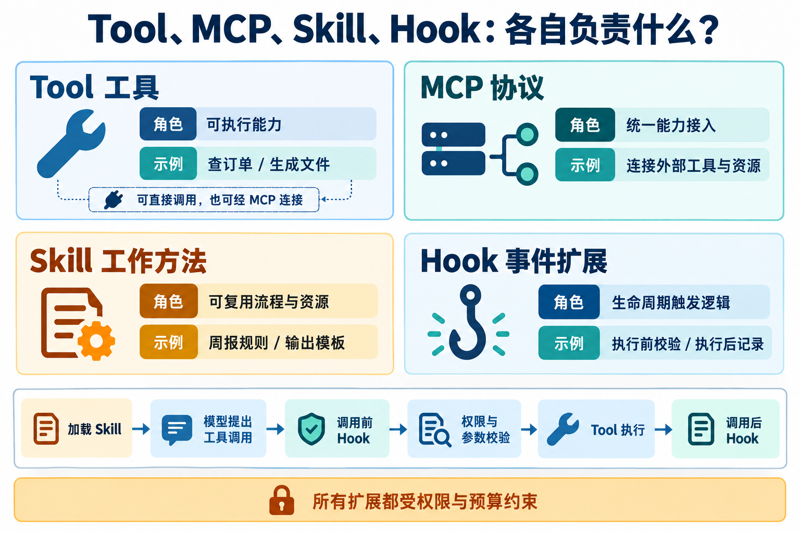
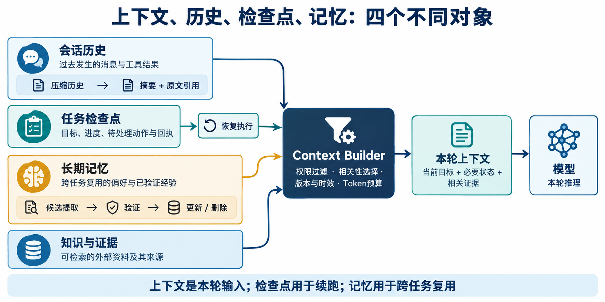
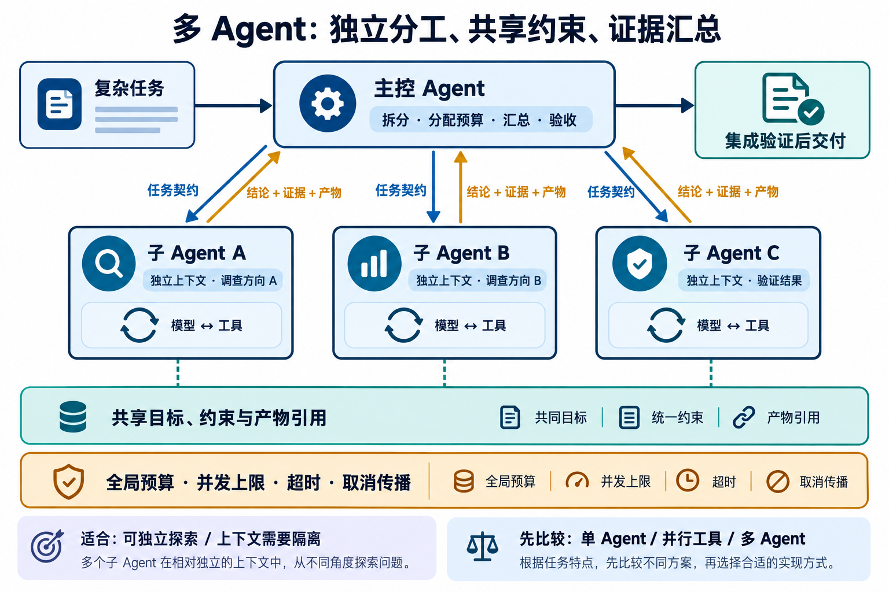

# AI 应用与 Agent 开发面试题及优质回答

> 整理日期：2026-09-30。面向 AI 应用、Agent 开发、大模型应用后端岗位。题目按公开面试资料中的重复主题与生产工程重要性整理；P0/P1/P2 表示建议复习优先级，不是统计得到的真实出题概率。参考回答是技术表达模板，不是个人项目经历。

## 使用方法与资料依据

每题按“考察点 → 参考回答 → 深入追问 → 失分点”阅读。先用 30—60 秒给出结论和机制，再根据追问展开。涉及项目时，把示例替换为自己的数据、日志和实际贡献；没有验证的改进使用“计划验证”，不能说“已经提升”。

选题线索来自公开面试汇总与社区讨论，例如 [Agent 面试主题汇总](https://github.com/youngyangyang04/llm-master/blob/main/docs/interview/llm/agent_interview.md)、[公开面经主题观察](https://www.nowcoder.com/discuss/914178628659707904)、[Agent 面试知识库目录](https://github.com/yibo365/agent-camp)。这些资料仅用于观察问题覆盖，不用于证明公司真实题库或技术结论；技术回答以官方文档、原论文和本文明确提出的工程设计为依据。

## 复习地图

| 模块 | 题号 | 重点 |
|---|---|---|
| Agent 与 Harness 基础 | Q01—Q08 | 概念、循环、框架与规划 |
| 工具、MCP、Skill、Hook | Q09—Q16 | 契约、权限、扩展与副作用 |
| 上下文与记忆 | Q17—Q24 | 预算、压缩、持久化与遗忘 |
| RAG 与知识工程 | Q25—Q34 | 检索、切块、评价与故障定位 |
| 多 Agent 与可靠性 | Q35—Q42 | 协作、恢复、并发与取消 |
| 模型、性能与成本 | Q43—Q50 | 基础原理、微调、推理与路由 |
| 评测、安全与系统设计 | Q51—Q60 | 上线标准、注入防护、架构题 |
| 项目表达与实操 | Q61—Q64 | 贡献、实验、编码与排障 |

## 一、Agent 与 Harness 基础



*看图练习：用 90 秒讲清四个主层的职责，再展开运行层内部的上下文层、工具层、模型层及 Agent 核心的协作关系。对应 Q01、Q05、Q06。*

### Q01【P0】LLM、Agent、Workflow、Harness 有什么区别？

**考察点：** 是否能把模型能力与运行系统分开。

**参考回答：** LLM 是根据输入产生输出的模型；Agent 围绕目标，根据观察选择动作并迭代；Workflow 用程序确定步骤和分支；Harness 是让 Agent 实际运行的外围系统，负责上下文、工具、状态、权限、恢复和验证。一个产品可以用 Workflow 管住大流程，在局部开放任务中运行 Agent。模型更强能改善决策，但不能代替数据库事务和权限检查。

**深入追问：** 为什么不全部 Agent 化？固定、低风险且规则明确的任务，用普通代码更便宜、更容易验证；只有路径不确定且需要适应反馈时才增加自主决策。[Building effective agents](https://www.anthropic.com/engineering/building-effective-agents)

**失分点：** 只说“Agent = LLM + 工具”，无法解释状态与控制边界。

### Q02【P0】一个完整的 Agent Loop 怎么实现？



*看图练习：顺着六个阶段复述执行过程，再说明候选结果如何验收、需要审批时如何等待，以及循环何时停止。*

**考察点：** 是否真正理解执行闭环。

**参考回答：** 加载目标和任务状态，检查取消与预算，装配上下文，调用模型，解析完整响应。如果有工具调用，先校验参数与权限，再执行并保存回执，把结果加入上下文后继续。如果需要用户输入就持久化等待；如果给出最终结果就按业务条件验收。任何阶段都要处理错误、停止和检查点，而不是一个没有边界的 while 循环。

**深入追问：** 模型返回多个工具调用怎么办？先判断依赖和资源冲突，独立只读调用可并行，写操作按契约调度；每个结果与原 call_id 对应。

**失分点：** 解析到一半 JSON 就执行，或模型输出最终文本就直接标记成功。[Function calling](https://developers.openai.com/api/docs/guides/function-calling)

### Q03【P0】ReAct 是什么？与工具调用有什么关系？

**考察点：** 能否区分决策模式与接口机制。

**参考回答：** ReAct 将推理、行动和环境观察交替组织，让后续决策依赖工具反馈。Function Calling 是模型表达动作的结构化接口，二者不是同一层概念。实际系统可以通过结构化工具调用实现类似 ReAct 的循环，不必在产品界面输出模型完整思维过程。日志重点保存动作、观察、简明理由和验证证据。[ReAct 原论文](https://arxiv.org/abs/2210.03629)

**深入追问：** ReAct 的弱点是什么？可能局部贪心、重复试错和上下文增长；可结合阶段计划、工具结果摘要、循环检测和验收标准。

**失分点：** 认为必须解析文本里的 Thought/Action 标签，或能靠展示思维链证明正确。

### Q04【P0】什么时候用固定工作流，什么时候用自主 Agent？

**考察点：** 是否有业务判断，而非追求复杂度。

**参考回答：** 我按路径确定性、风险和验收方式选择。固定数据抽取、审批流和金额计算优先用程序；开放式调查、跨资料分析适合 Agent；混合场景用确定性流程控制身份、审批和提交，让 Agent 完成信息理解与方案生成。选择标准是满足质量和成本要求，而不是工具名字。

**深入追问：** 如何比较？在同一业务集上比较成功率、维护成本、延迟和异常处理成本。流程稳定时，已学到的操作也可以逐渐固化为代码。

**失分点：** 所有节点都安排一次模型调用。

### Q05【P0】如何从零设计一个 AI 应用的总体架构？

**考察点：** 是否能先讲系统全貌，再进入细节。

**参考回答：** 我先明确用户、任务、数据、写操作、SLA 与规模，再分成交互层、网关层、应用层、运行层四个主层。运行层内部包含上下文层、工具层、模型层，由 Agent 核心负责执行循环、状态机与调度。数据库、事件、对象存储与队列提供底座；权限、观测、评测、成本横向贯穿。先用模块化单体加 Worker，随着瓶颈和组织边界再拆服务。

**深入追问：** 最重要的三个设计？副作用幂等、可恢复状态、可验证的完成标准。它们决定系统能否从演示进入真实业务。

**失分点：** 上来罗列向量库、框架和模型，无法画出请求路径。

### Q06【P1】为什么参考 Claude Code、Codex 的 Harness？

**考察点：** 是否理解真实产品中的循环与交互。

**参考回答：** 它们展示了长任务需要的共同能力：上下文管理、真实工具反馈、过程可见、用户干预与验证。Codex 的 App Server 还提供了客户端集成的公开接口参考。我会借鉴这些职责，再按企业业务增加租户、审批、队列和数据治理；不能把自己的云架构说成厂商实际内部实现。

**深入追问：** Coding Agent 与客服 Agent 有什么不同？代码有文件、测试和差异作为反馈；客服更依赖知识时效、用户身份、业务状态和沟通质量，因此验收和权限设计不同。

**失分点：** 背诵未验证的产品内部实现。[Claude Code 工作原理](https://code.claude.com/docs/en/how-claude-code-works)、[Codex App Server](https://learn.chatgpt.com/docs/app-server)

### Q07【P1】LangChain、LangGraph、SDK 与自建 Harness 怎么选？

**考察点：** 能否根据需要选择抽象。

**参考回答：** 我先列必需能力：工具循环、分支状态、持久化、中断、人审与观测。简单任务可用 SDK 或轻量自建；图结构流程需要明确状态与恢复时可用图式框架；跨小时或跨服务等待可考虑持久化工作流。框架能减少重复代码，但业务权限、数据隔离、幂等和评测仍需要实现。

**深入追问：** 如何避免框架绑定？把业务动作、状态模型和供应商适配放在明确接口后面，保留配置版本与原始回执，而不是把业务逻辑散落在提示词和框架回调中。

**失分点：** “用了框架，所以断点恢复和生产安全都解决了。”

### Q08【P1】Planner—Executor—Verifier 要拆成三个 Agent 吗？

**考察点：** 是否能区分逻辑角色与运行实体。

**参考回答：** 不必。三者可以是同一运行时中的阶段，Verifier 甚至应优先使用测试或规则。只有上下文、工具权限或独立判断需求足够明显时，才拆成多个 Agent。计划需要目标、依赖、交付物和验收条件，执行后根据观察修订；验证失败要给出具体反馈，并有修复上限。

**深入追问：** 同一模型自评可信吗？能作为辅助，但可能共享盲点。关键业务依赖独立证据、确定性检查和人工抽检。

**失分点：** 认为多写三个角色 Prompt 就获得了相互独立的质量保障。

## 二、工具、MCP、Skill、Hook



*看图练习：用“生成周报”举例，分别指出工作方法、工具调用、接入协议和前后置事件扩展。对应 Q09—Q16。*

### Q09【P0】Function Calling 的完整流程是什么？

**考察点：** 模型和执行程序的职责边界。

**参考回答：** 应用向模型提供工具名称、描述和参数 Schema；模型返回工具调用及参数；应用校验并执行函数，把结果连同关联 ID 返回模型，模型再生成答案或继续调用。模型通常不在自己的推理过程中直接执行我们的业务代码。生产环境还要加入权限、超时、调用台账与错误处理。

**深入追问：** 如何提高工具选择准确率？工具职责清晰、描述包含适用与不适用场景、参数枚举明确、工具集按任务筛选，再用真实误调用样本评测。

**失分点：** 把工具调用当成模型可以直接访问数据库，或接受模型生成的任意函数名。

### Q10【P0】JSON Mode、Structured Outputs 和业务校验有什么区别？

**考察点：** 是否把格式约束误当成事实保证。

**参考回答：** JSON Mode 主要约束可解析 JSON；Structured Outputs 在支持的 Schema 范围内约束字段和类型，但两者都不能保证事实与业务语义正确。生成金额为数字，不代表金额可退；生成 order_id 为字符串，不代表订单属于当前用户。应用仍要校验对象存在性、归属、状态与额度，并处理拒绝、截断和协议异常。

**深入追问：** 格式失败怎么办？识别是截断、Schema 不支持还是模型输出问题，允许有限修复；不能无限重试，也不能默认填入可能产生副作用的参数。

**失分点：** “开 strict 就没有幻觉了。”[Structured outputs](https://developers.openai.com/api/docs/guides/structured-outputs)

### Q11【P0】MCP、Function Calling、Skill、Hook 有什么关系？

**考察点：** 能否明确机制层次。

**参考回答：** Function Calling 是模型提出结构化工具调用的机制；MCP 是应用连接外部工具与上下文的协议；Skill 提供可复用的任务方法和资源；Hook 是生命周期事件触发的扩展。比如 Skill 指导如何生成周报，模型通过工具调用选择查询能力，MCP 适配器访问业务系统，Hook 在执行后记录统计。

**深入追问：** 一定要全部用吗？不需要。几个本地函数可直接注册工具，稳定任务可以只用 Workflow；能力多、跨应用复用时再引入标准协议与扩展治理。

**失分点：** 把 MCP 说成 Agent 调度框架，或认为 Skill 自带系统权限。[MCP 架构](https://modelcontextprotocol.io/docs/learn/architecture)

### Q12【P1】一个生产级 MCP Server 应考虑什么？

**考察点：** 从“能连通”到“可运营”的差距。

**参考回答：** 除工具发现和调用外，还需身份验证、每次资源授权、参数验证、输出大小限制、超时、并发限制、幂等、可观测性和版本兼容。工具描述与输出都带来源，凭证不能透传到不应接收它的下游。服务端不可相信模型提供的 user_id 就是实际用户，必须使用可信身份上下文。

**深入追问：** Server 已认证，输出就可信吗？认证只证明连接身份，不能保证内容没有注入、错误或过期。调用端仍要维持数据与指令边界。

**失分点：** 把 OAuth 接入等同于完整业务授权。[MCP 安全实践](https://modelcontextprotocol.io/specification/latest/basic/security_best_practices)

### Q13【P0】如何设计一个好工具？

**考察点：** 工具接口是否适合模型使用和程序校验。

**参考回答：** 工具要有单一清楚的业务目的、可区分的名称、简洁但充分的描述、明确的参数类型与单位、稳定的结构化输出，以及可操作的错误反馈。把读取、准备和提交分开，减少模型一次调用造成不可逆结果的风险。输出优先返回关键字段和全文引用，避免把巨大日志塞回上下文。

**深入追问：** 大而全的工具还是细粒度工具？过细会增加轮次，过大会扩大参数空间和权限。按业务原子操作划分，再通过评测比较成功率与调用开销。

**失分点：** 一个通用 SQL/Shell 工具暴露全部能力，却没有范围限制。

### Q14【P0】工具超时了，能不能自动重试？

**考察点：** 副作用与分布式系统基本功。

**参考回答：** 先判断操作类型和是否已生效。只读调用可在预算内退避重试；写操作超时可能已经成功，应使用稳定业务幂等键查询或安全重试。没有幂等和查询能力时，结果是 UNKNOWN，需要对账或人工处理。把 429、参数错误、权限拒绝和业务冲突分开，不能统一重试。

**深入追问：** 幂等键用参数哈希行不行？同样参数可能是用户有意再次操作。应该用逻辑动作 ID，重试沿用 ID，新业务动作产生新 ID。

**失分点：** “所有异常重试三次”，或宣称数据库唯一键能让远程调用严格 exactly-once。

### Q15【P1】Skill 如何设计和治理？

**考察点：** 能力复用与上下文开销。

**参考回答：** Skill 包含工作说明、适用条件、资源与可选脚本。发现阶段只加载元数据，匹配后再读取正文；版本固定到任务配置中。发布前做静态检查和任务评测，执行中记录效果，支持升级与撤回。权限由应用策略决定，Skill 只能声明需要什么，不能自行扩大权限。

**深入追问：** Skill 和 Prompt 模板差在哪？Skill 可包含资源、脚本和完整工作流程，生命周期更完整；但其自然语言部分仍会存在理解与执行不确定性。

**失分点：** 一启动就加载所有 Skill 全文，或自动相信外部 Skill 的命令。[Codex Skills](https://learn.chatgpt.com/docs/build-skills)

### Q16【P1】Hook 能做什么？如何防止 Hook 拖垮系统？

**考察点：** 扩展点的执行语义。

**参考回答：** Hook 用于动作前校验、参数规范化、执行后记录和完成前验证。同步阻断 Hook 必须有限时、失败策略和清晰优先级；异步统计 Hook 可重试或进入死信队列。限制递归深度与输出，使用事件 ID 去重。后置 Hook 不能阻止已经发生的写操作；强制权限校验也不能只是可随意关闭的 Hook。

**深入追问：** Hook 修改了参数怎么办？重新进行 Schema、权限与审批摘要校验；批准原参数不能授权修改后的操作。

**失分点：** 认为所有 Hook 都是确定性代码，或所有 Hook 都有阻断能力。[Claude Code Hooks](https://code.claude.com/docs/en/hooks)

## 三、上下文与记忆



*看图练习：分别说出“本轮输入”“执行恢复”“跨任务复用”对应哪个对象，再回答 Q17—Q24。*

### Q17【P0】Prompt Engineering 与 Context Engineering 有什么区别？

**考察点：** 能否从写提示词上升到信息供给设计。

**参考回答：** Prompt Engineering 关注如何表达指令和示例；Context Engineering 还管理每轮模型能看到哪些历史、工具、检索证据、状态、记忆和环境信息，以及它们的权限、顺序、时效与预算。正确指令配上错误或过期证据仍会失败，所以我会把上下文构建做成可观察、可评测的模块。

**深入追问：** 如何证明优化有效？固定任务集，对召回、压缩和排序分别做消融，测成功率、约束遗漏和总 Token，而不是只看 Prompt 变短。

**失分点：** 把所有东西拼进一个大字符串。[上下文工程](https://www.anthropic.com/engineering/effective-context-engineering-for-ai-agents)

### Q18【P0】上下文快满了怎么办？

**考察点：** 是否考虑信息损失和协议完整性。

**参考回答：** 先识别占用来源：过大工具输出、重复文档、无关历史还是工具定义。优先按需加载、去重和外置，再把旧对话压缩为结构化状态，保留目标、硬约束、已确认决策、待处理动作和证据引用。为输出留预算，保留完整调用—结果配对，避免裁出非法消息序列。

**深入追问：** 压缩后如何知道没忘事？对关键约束和未完成动作做程序化一致性检查，高风险事实重新读取；摘要不能保证完全无损。

**失分点：** 只保留最后 10 条消息，或每次快满就无条件再总结一遍。

### Q19【P0】上下文、会话历史、检查点、长期记忆怎么区分？

**考察点：** 存储语义是否清楚。

**参考回答：** 上下文是本轮送给模型的信息；会话历史是过去发生过的交互；检查点保存可继续运行的执行状态；长期记忆保存跨任务有复用价值的信息。四者可以相互引用但不能互相替代。例如聊天记录保留了创建订单的文本，不代表已保存足以避免重复创建的外部回执。

**深入追问：** 为什么不把所有历史重新发给模型？成本、上下文上限、噪声、权限变化和时效都会带来问题。

**失分点：** 把“保存 messages 数组”说成完整断点恢复。

### Q20【P0】长期记忆系统怎么设计？

**考察点：** 是否有写入、读取和更新闭环。

**参考回答：** 按用户、项目和组织划分作用域，区分偏好、稳定事实与任务经验。条目包含内容、来源、时间、版本、可信度和有效期。写入时做价值判断、敏感过滤、去重与冲突处理；读取时先授权过滤，再按相关性与时效排序。用户可查看、修改和删除，关键事实使用前复核。

**深入追问：** 向量库是不是必需？不是。偏好和明确实体属性适合关系表或 KV；向量索引帮助语义召回，但不负责真值和权限。

**失分点：** 自动保存所有对话，并把模型猜测当成长期事实。

### Q21【P1】记忆冲突、过期和删除怎么处理？

**考察点：** 记忆是否能长期维护。

**参考回答：** 当前明确用户偏好可覆盖旧偏好；业务事实要比较来源权威性和有效时间，不能简单最新文本胜出。对变化快的信息设置 TTL 或使用前重验。删除需覆盖主记录、检索索引、缓存与派生摘要，保留策略和备份机制应在产品规则中明确。

**深入追问：** 历史任务用了后来被撤销的记忆怎么办？保留任务当时的来源与版本用于审计，但新任务不能继续召回已撤销内容；访问历史也要遵循当前权限。

**失分点：** 只从向量库删一条记录，就声称系统已完全遗忘。

### Q22【P0】Prompt Cache、语义缓存和 Memory 有什么区别？

**考察点：** 计算复用、结果复用与知识复用的区别。

**参考回答：** Prompt Cache 复用相同前缀的推理中间计算；语义缓存按相似问题复用历史结果；Memory 按任务需要取回经验和事实，再参与新决策。前缀缓存不保证相同答案，语义相似也不保证两个请求权限和业务状态相同。缓存键与失效策略要包含授权范围和数据版本。

**深入追问：** 压缩后缓存命中下降怎么办？比较完整任务的输入量、缓存写读费用与质量，不能单独追求命中率。

**失分点：** 把缓存说成模型学会了用户知识。[Prompt caching](https://developers.openai.com/api/docs/guides/prompt-caching)

### Q23【P1】工具和 Skill 太多，怎样控制上下文占用？

**考察点：** 动态能力发现。

**参考回答：** 注册中心保留全量元数据，先按权限和任务筛选，再按描述检索少量候选，加载其完整 Schema 或 Skill 正文。当前执行计划可能需要的能力可以预取；保持版本稳定，失败时允许扩大候选范围。评测工具召回率与误调用率，防止为了省 Token 把关键工具漏掉。

**深入追问：** 检索到了无权限工具怎么办？不向模型暴露可执行能力，真正调用时仍做服务端鉴权。

**失分点：** 只压缩工具描述却没有测选择准确率。

### Q24【P1】长上下文模型是否意味着不需要 RAG 和记忆？

**考察点：** 能否理解容量与管理是不同维度。

**参考回答：** 长上下文提高单次可见容量，但数据仍有更新、权限、成本和相关性问题。小且稳定的资料集可以直接放入上下文；大规模、多租户或频繁更新的知识需要检索与治理。记忆还解决跨会话生命周期与用户偏好，不能仅靠更长窗口替代。

**深入追问：** 如何选长上下文还是检索？在相同任务上测证据覆盖、答案质量、延迟和总成本，并检查访问权限能否精确控制。

**失分点：** 用模型最大窗口长度直接推出业务可用信息量。

## 四、RAG 与知识工程

### Q25【P0】完整的 RAG 链路是什么？

**考察点：** 是否覆盖离线和在线两条链路。

**参考回答：** 离线做数据接入、解析、结构化切块、去重、版本与权限关联，再建立关键词和向量索引。在线做问题理解、必要的改写、多路召回、融合与重排、证据选择，最后把证据交给模型生成带引用的答案。每个片段能回到具体原文和版本，更新或删除可追踪到索引与缓存。

**深入追问：** RAG 解决什么、不解决什么？它提供外部证据与可更新知识，但不能保证检索正确，也不能自动消除生成错误。[RAG 原论文](https://arxiv.org/abs/2005.11401)

**失分点：** 只说“Embedding 入库，再 Top-k 查询”，漏掉解析、授权与评测。

### Q26【P0】文档怎么切块？chunk_size 和 overlap 怎么选？

**考察点：** 是否根据内容结构调参。

**参考回答：** 优先按标题、段落、条款、代码符号和表格结构切分，再控制 Token 长度。过小容易缺上下文，过大会混入多个主题并占用预算；重叠可减少边界损失，但增加重复与索引成本。把章节路径、文档名称和必要表头附到片段，使用任务集比较不同配置下的召回与答案质量。

**深入追问：** 父子块有什么用？用细块提高召回精度，再按需要取父级上下文补足含义；不能每次无条件返回整个父文档。

**失分点：** 宣称“500 Token、重叠 100”是通用最优参数。

### Q27【P0】BM25 与向量检索有什么区别？为什么要混合检索？

**考察点：** 是否理解稀疏与稠密召回的互补性。

**参考回答：** BM25 基于词项匹配、词频饱和和文档长度归一化，对编号、专有名词和精确术语常有优势；向量检索用嵌入表示语义，对同义表达更友好。业务问题通常同时含语义和精确条件，所以可并行召回，再融合排序。分词、字段权重和元数据过滤也影响效果。

**深入追问：** 相似度越高就越正确吗？不一定。相似只代表表示空间接近，不代表版本正确、条件满足或内容真实。

**失分点：** 认为向量检索完全替代关键词检索。[Contextual Retrieval](https://www.anthropic.com/engineering/contextual-retrieval)

### Q28【P1】RRF、Rerank、Embedding 各自负责什么？

**考察点：** 多阶段检索的职责。

**参考回答：** Embedding 把查询和文本映射为可比较的向量，便于大规模初召回；RRF 根据多个召回列表中的名次融合候选，例如对每个列表累加 1/(k+rank)，这里 k 是平滑常数；Reranker 再对查询与候选的匹配程度进行精排。RRF 不要求不同检索器的原始分数同尺度，Rerank 更精细但更贵。

**深入追问：** 为什么不对全库 Rerank？候选逐对计算成本高，先召回再重排能控制延迟；但初召回漏掉的文档，重排无法恢复。

**失分点：** 混淆 RRF 的平滑常数与 Top-k 的 k，或直接相加未校准的检索分数。[RRF 原论文](https://cormack.uwaterloo.ca/cormacksigir09-rrf.pdf)

### Q29【P0】RAG 答错了，如何定位？

**考察点：** 是否有证据驱动的排障方法。

**参考回答：** 沿链路检查：原始知识是否包含答案；解析是否保留表格与限定条件；切块和索引是否正确；相关证据是否进入召回候选；重排是否把它放到前面；装配时是否被裁掉；模型是否误读证据；引用是否对应结论。先用人工标注的正确证据替换检索结果，可初步区分检索问题和生成问题。

**深入追问：** Recall 高但答案差怎么办？检查证据噪声、冲突版本、缺失条件、上下文顺序和生成约束，再评估模型能力。

**失分点：** 不看召回结果，直接调大 Top-k 或更换模型。

### Q30【P0】怎么评价 RAG？Recall@k、MRR 和答案忠实度是什么？

**考察点：** 能否分离检索质量和回答质量。

**参考回答：** 有完整相关集合标注时，Recall@k 是前 k 个结果覆盖的相关项占比；若只有一个已知相关项，命中情况更接近 Hit@k 的口径。MRR 对每个问题取首个相关结果名次的倒数再平均。答案层另测事实正确性、是否被证据支持、引用正确性、完整性和合理拒答。相关标签不完整时，必须说明指标的限制。

**深入追问：** 忠实度高就是回答正确吗？可能忠实引用了过期或错误资料，因此还需要来源与时间正确性。

**失分点：** 把检索分数当作答案置信度，或只测“用户感觉不错”。

### Q31【P0】企业知识库如何做权限隔离和更新？

**考察点：** 多租户系统的真实数据边界。

**参考回答：** 文档、片段、索引记录与缓存都关联租户和 ACL，检索时使用可信身份限制候选，读取原文和返回产物时再次鉴权。授权变更和文档更新通过事件同步索引及缓存；保留文档版本，构建新索引后验证再切换。不能先把无权限片段交给模型，再让模型自行决定不说。

**深入追问：** 过滤导致召回不足怎么办？使用支持过滤的索引、租户分区或受控扩大候选，但任何候选进入模型前都必须满足权限。

**失分点：** 只在前端隐藏文档，或复用不含权限信息的答案缓存。

### Q32【P1】Query Rewrite、HyDE、Agentic RAG 什么时候用？

**考察点：** 能否判断增强检索的成本收益。

**参考回答：** 改写适合多轮指代和表达不完整的问题；HyDE 用生成的假想文档帮助检索，但假想内容只能作为检索线索，不能当证据；Agentic RAG 允许根据结果继续检索或切换数据源，适合多跳和开放问题。先建立固定检索基线，再逐项验证收益，保留原始查询，防止改写偏离意图。

**深入追问：** 什么时候停止检索？验收所需证据齐全、连续无新增信息、达到时间或预算上限时停止，并说明缺口。

**失分点：** 用更多检索轮次掩盖知识库根本没有答案。[HyDE 原论文](https://arxiv.org/abs/2212.10496)

### Q33【P0】RAG、微调、Prompt 优化怎么选？

**考察点：** 是否按错误原因选择方案。

**参考回答：** 缺少最新或私有事实，优先 RAG 或业务工具；输出格式、任务约束和少量示例不足，先优化 Prompt 与结构化输出；稳定任务上存在持续行为或风格差距，且有高质量训练数据时再考虑微调。它们可以组合：微调学习任务模式，检索提供当前事实。先评测定位瓶颈，避免把所有问题交给训练。

**深入追问：** 为什么不把企业知识全部微调进去？更新和删除困难，难精确引用，也难实现逐文档访问控制；模型参数不适合替代知识权限系统。

**失分点：** 认为微调后知识永远正确，或 RAG 能解决一切推理问题。

### Q34【P1】向量数据库怎么选？HNSW、过滤和索引迁移要考虑什么？

**考察点：** 检索系统工程与规模意识。

**参考回答：** 看数据量、维度、更新频率、过滤需求、延迟、召回目标、内存与运维成本。HNSW 是常见近似近邻索引，搜索范围和图参数影响召回、延迟和内存。数据量小可先用现有数据库的向量扩展，避免过早引入独立系统；规模扩大后基于真实负载评测。

**深入追问：** 换 Embedding 模型怎么办？新旧模型通常不能直接混在同一向量空间比较，需要重建索引、离线验证、双写或分阶段迁移，并保留回滚方案。

**失分点：** 只比较宣传吞吐，忽略带 ACL 过滤和持续更新时的表现。[HNSW 原论文](https://arxiv.org/abs/1603.09320)

## 五、多 Agent 与可靠性



*看图练习：解释两种箭头的方向、各子任务的权限与预算，以及哪些步骤必须等待依赖完成。对应 Q35—Q37。*

### Q35【P0】什么时候用多 Agent，什么时候只用并行工具？

**考察点：** 是否能识别额外推理的必要性。

**参考回答：** 如果只是独立查询多个 API，普通并行工具即可；如果每个分支都要独立探索、判断和反复调用工具，才值得子 Agent。多 Agent 适合可分离任务、不同权限工具集和上下文隔离，代价是拆分、通信、汇总与更多 Token。应与单 Agent 和并行工具基线比较。

**深入追问：** 并行是不是一定更快？整体由关键路径决定；共享限额、慢分支、合并和冲突可能抵消收益。

**失分点：** 把每个函数都包装为 Agent。[多 Agent 研究系统](https://www.anthropic.com/engineering/multi-agent-research-system)

### Q36【P0】多 Agent 如何通信和共享状态？

**考察点：** 分工契约与一致性。

**参考回答：** 默认主控—工作者结构，主控分配目标、范围、输入、权限、预算和交付格式。子 Agent 独立上下文，通过结构化结果和产物引用回传，共享事实放在带版本与来源的存储中。文件修改按所有权或独立分支隔离，合并后统一验证。

**深入追问：** 为什么不让所有 Agent 共享完整聊天？噪声、成本与相互影响都会增大；它们通常只需要目标约束和相关证据。

**失分点：** 依赖自然语言互相“商量好”，却没有资源冲突处理和结果验收。

### Q37【P1】如何防止多 Agent 成本爆炸和无限委派？

**考察点：** 全局资源治理。

**参考回答：** 限制扇出、递归深度、同时活跃数、每子任务预算与总预算，创建子任务前原子预留额度。父任务取消向下传播；没有新信息的重复任务合并或停止；等待时事件唤醒，不反复调用主模型。汇总仍需留预算，避免全部额度花在探索阶段。

**深入追问：** 子 Agent 花超预算怎么办？执行前估算、调用中限制、完成后结算，结合余量与供应商实际计费对账。不能只在最后统计费用。

**失分点：** 只给每个 Agent 单独上限，却没有父任务总账。

### Q38【P0】Agent 为什么会死循环？怎么处理？

**考察点：** 是否既能检测症状，也能找原因。

**参考回答：** 原因可能是工具反馈含糊、错误被吞掉、目标不可达、缺少停止条件或上下文丢失。给调用和结果建立指纹，检测重复；同时设置步骤、时间和预算上限。达到阈值后检查是否有新证据，允许改变策略、请求缺失信息或明确失败，不继续原样重试。

**深入追问：** 多次同样查询一定是循环吗？不一定，可能合法轮询。工具需声明轮询语义、合理间隔和截止时间，最好改成外部事件通知。

**失分点：** 只加 max_iterations，却不解释失败原因和用户如何继续。

### Q39【P0】Worker 崩溃后如何续跑？

**考察点：** 持久化状态与外部副作用。

**参考回答：** 用检查点保存状态，用事件记录后续变化，恢复 Worker 领取租约后重建执行位置。先检查未完成的外部动作：有回执的复用结果，状态未知的查询确认。再重验权限、配置兼容性和资源版本，继续尚未完成的步骤。已消耗预算和待审批状态也必须恢复。

**深入追问：** 图框架能自动完成这些吗？检查点和中断机制能帮助恢复执行，但远程副作用是否幂等仍取决于工具契约。[LangGraph Persistence](https://docs.langchain.com/oss/python/langgraph/persistence)

**失分点：** 从上一条用户消息重新完整执行任务。

### Q40【P0】如何避免同一任务被两个 Worker 同时执行？

**考察点：** 队列投递与所有权。

**参考回答：** 队列按至少一次投递设计，用数据库状态和租约竞争领取任务；状态写入携带版本与 fencing token，过期 Worker 不能继续更新。对外写动作还要独立幂等，因为本地锁无法撤回已经发出的远程请求。续租失败应尽快停止后续动作，结果仍需保存或对账。

**深入追问：** Redis 锁为什么不够？租约过期、网络分区和暂停可能让旧 Worker 继续运行；目标存储必须识别过期所有者，外部系统则需自己的防重复契约。

**失分点：** “加分布式锁就严格执行一次。”

### Q41【P0】如何实现 Human-in-the-loop 和用户取消？

**考察点：** 人工等待能否跨重启持续。

**参考回答：** 等待批准时把动作摘要、具体参数、请求人、有效期与任务状态持久化，释放 Worker。批准接口验证审批者、动作版本和任务状态，成功后事件唤醒。取消是状态变更和向下传播的信号，UI 区分已请求取消与已确认停止；已完成的远程操作要走补偿流程。

**深入追问：** 批准期间订单状态变化怎么办？提交前重新校验，必要时重新准备和批准，防止检查与使用之间出现状态变化。

**失分点：** 用一个挂起的内存 Promise 等人工几小时，服务重启就丢失。[LangGraph Interrupts](https://docs.langchain.com/oss/python/langgraph/interrupts)

### Q42【P1】SSE 断线重连如何保证状态一致？

**考察点：** 实时交互与任务生命周期解耦。

**参考回答：** 任务独立于连接运行，关键事件持久化并有 Run 内单调序号。客户端携带游标重连，服务端补发，客户端按 event_id 去重；事件已过保留期时返回快照及新的游标。Token 流可分批保存，但完成、审批和工具回执不能只存在内存里。

**深入追问：** 用户关闭页面是否取消任务？应由产品语义决定，默认不能把 TCP 断开等同于明确取消。取消要有独立接口和授权。

**失分点：** SSE 重连后直接再发一次原始任务。

## 六、模型、性能与成本

### Q43【P1】应用工程师应该怎样解释 Transformer、Token 和 Attention？

**考察点：** 基础原理能否联系工程问题。

**参考回答：** Token 是分词器处理的基本单位，不等于一个汉字或单词。模型把 Token 转成向量，再通过多层注意力与前馈网络建立上下文表示。典型缩放点积注意力为 softmax(QKᵀ/√dₖ)V；生成式 decoder 使用因果掩码，不能访问未来位置。位置表示提供顺序信息。上下文长度、Token 数和生成长度直接影响延迟、显存与成本。

**深入追问：** 为什么经典稠密注意力随长度增长很贵？长度 n 时注意力分数涉及 n×n 的交互；优化内核可以减少中间存储和访存，但不能因此说所有注意力计算都变成线性。现代模型可能采用不同注意力结构，需要按实际模型讨论。

**失分点：** 把 Embedding 当成关键词编号，或把所有 LLM 都描述为同一种精确结构。[Attention Is All You Need](https://arxiv.org/abs/1706.03762)

### Q44【P0】temperature、top_p 怎么调？设为 0 就不会幻觉吗？

**考察点：** 随机性与正确性的区别。

**参考回答：** temperature 调整输出概率分布的尖锐程度，top_p 限制采样候选的累计概率范围。事实提取、分类通常偏向低随机性，创意生成可以放宽，但要按模型支持的参数和评测结果配置。低随机性只减少采样变化，不能补足缺失知识，也不能保证不同硬件、版本和服务条件下完全一致。

**深入追问：** 怎么让结果可复现？固定模型版本、Prompt、工具版本、数据快照和解码配置，记录真实输入输出；实验重复多次并报告波动。生产环境变化也需留痕。

**失分点：** “temperature=0 就是确定且正确的答案。”

### Q45【P1】SFT、LoRA、QLoRA、RLHF、DPO 分别是什么？

**考察点：** 训练目标与参数更新方法是否分得清。

**参考回答：** SFT 用输入—目标输出样本训练任务行为；LoRA 冻结基础权重，用低秩矩阵学习权重增量，是参数高效微调方式；QLoRA 在量化基础模型上训练适配器以降低训练内存。RLHF 是利用人类反馈优化模型的训练范式；DPO 是直接利用偏好对优化策略的一种方法，避免经典奖励模型加在线 RL 的完整流程。SFT 可以采用 LoRA，它们不是互斥选项。

**深入追问：** LoRA 参数量怎么估？对于 d_out×d_in 的矩阵，用 B(d_out×r)A(r×d_in) 表示增量，参数量约为 r(d_out+d_in)，再乘以实际注入层数。训练显存还包括激活、梯度、优化器状态，不能只算适配器权重。

**失分点：** 把量化等同于微调，或认为微调一定比 RAG 适合私有知识。[LoRA](https://arxiv.org/abs/2106.09685)、[QLoRA](https://arxiv.org/abs/2305.14314)、[DPO](https://arxiv.org/abs/2305.18290)

### Q46【P1】KV Cache、Prefill、Decode、PagedAttention 是什么？

**考察点：** 能否解释推理性能瓶颈。

**参考回答：** Prefill 处理输入上下文并建立表示；Decode 逐步生成新 Token。KV Cache 保存过去位置的 Key/Value，减少重复计算，但占用显存。PagedAttention 用分块管理改善 KV 内存利用；连续批处理提高不同请求混合执行时的资源利用。Prefix Cache 可复用相同前缀的计算，主要改善 Prefill，不消除 Decode。

**深入追问：** KV 显存如何估计？标准未压缩 KV 可近似为 2×层数×序列长度×KV 头数×头维度×每元素字节数，再对活跃序列求和。GQA/MQA、量化、滑窗、缓存共享会改变实际占用；不能机械使用 Query 头数。

**失分点：** 只根据参数量决定 GPU 数量，忽略上下文和并发带来的 KV 占用。[PagedAttention 论文](https://arxiv.org/abs/2309.06180)、[vLLM Prefix Cache](https://docs.vllm.ai/en/latest/features/automatic_prefix_caching/)

### Q47【P0】如何选择模型并做多模型路由？

**考察点：** 是否基于业务评测，而非榜单。

**参考回答：** 先筛掉不满足上下文、工具调用、结构化输出、多模态和数据部署要求的模型，再用代表性任务比较质量、延迟、成本与稳定性。简单分类和抽取用较轻方案，复杂推理适当升级。路由也会犯错，所以要测路由准确性与整体收益，保留质量低于门槛时的升级路径。

**深入追问：** 模型故障能随便回退吗？回退模型需支持当前契约，并明确如何处理上下文和进行中的工具调用；远程动作状态未知时不能重跑整段任务。

**失分点：** 只选最强模型，或只按 Token 单价比较成本。

### Q48【P0】用户说 Agent 太慢，怎么优化？

**考察点：** 端到端性能诊断。

**参考回答：** 先拆分排队、检索、Prefill、生成、工具调用、子任务等待和验证耗时，观察关键路径与 P95。优先减少不必要模型轮次和输出，独立 I/O 并行，优化检索、缓存和工具接口；适合时用更快模型。流式反馈改善等待体验，但要单独报告完整任务时间。

**深入追问：** 增加并发为什么反而变慢？可能撞上 TPM 限额、下游连接池、GPU KV 内存或队列饱和，导致尾延迟和重试增加。需限制在途请求与施加背压。

**失分点：** 只谈模型 Tokens/s，不看工具和排队。[Latency optimization](https://developers.openai.com/api/docs/guides/latency-optimization)

### Q49【P0】如何降低成本，同时不明显降低质量？

**考察点：** 成本是否包含失败与返工。

**参考回答：** 用每成功任务总成本衡量，把模型、工具、检索、沙箱、失败重试和人工接管都计入。依次减少无价值轮次、控制工具输出、选择必要上下文、复用稳定前缀、对简单任务使用便宜方案，再按需要开启多 Agent。每次优化在相同任务集上对照质量门槛，便宜但常失败的模型可能更贵。

**深入追问：** 为什么 Token 减少了账单却没降？可能缓存写读价格、模型路由、工具费用和重试发生变化；必须按供应商实际计量归因。

**失分点：** 只统计最终一次回答，不算子 Agent 与失败尝试。

### Q50【P0】如何估算容量并设计限流？

**考察点：** 能否从用户请求推导模型与工具负载。

**参考回答：** 假设每秒 5 个任务，每个平均持续 40 秒，则平均在途约 200。若每任务 6 次模型调用，则约 30 次/秒；每次输入 5,000、输出 500 Token，则分别约 900 万输入 TPM、90 万输出 TPM。这些是假设，实际还需峰值与重试余量。限流要覆盖租户活跃任务、模型 RPM/TPM、工具并发和沙箱资源。

**深入追问：** 200 个在途任务就要 200 个 Worker 吗？不一定，很多任务等待 I/O 或人工；执行槽位按实际阶段资源计算。模型并发要用模型调用到达率乘以模型服务时间。

**失分点：** 只给入口加 QPS 限流，内部扇出完全不受控。

## 七、评测、安全与系统设计

### Q51【P0】如何设计 Agent 的评测集和上线门槛？

**考察点：** 有没有超越演示的质量方法。

**参考回答：** 从真实业务任务和失败案例构建样本，覆盖正常、边界、故障和对抗场景，明确结果验收标准。分别评估业务结果、工具过程、安全约束、延迟和成本，开发集用于调优，留出集用于最终比较。高风险动作有硬性门槛，开放质量用人审或校准裁判。上线先小范围灰度，监测退化并可回滚。

**深入追问：** 任务可有多条正确路径，怎么判？按结果与必要过程约束评测，不强制复制某条唯一工具轨迹；但不可越权或跳过必需审批。[Evaluation best practices](https://developers.openai.com/api/docs/guides/evaluation-best-practices)

**失分点：** 只测几个成功案例，或把模型自评当作最终正确率。

### Q52【P0】LLM-as-a-Judge 靠谱吗？怎么校准？

**考察点：** 是否理解评测器也会犯错。

**参考回答：** 它适合规模化评估开放文本，但存在位置、长度、风格与自我偏好。给出明确评分维度和证据要求，用专家标注集测一致性与错误类型；成对比较时交换答案顺序，隐藏模型身份，加入明显错误和边界样本。关键事实与操作结果优先用程序或业务数据检查。

**深入追问：** Judge 分数提升是否意味着上线收益？需要检查它与人审和用户业务结果是否相关，防止系统学会迎合裁判而没有实际改善。

**失分点：** “用更强模型打分就绝对客观。”

### Q53【P0】Prompt Injection 是什么？怎么防？

**考察点：** 是否理解不可信内容跨越指令边界。

**参考回答：** 攻击者把指令放在网页、文档或工具结果等数据中，诱使模型改变目标、泄漏信息或执行越权动作。防御采用多层控制：标记来源并隔离数据、限制工具与数据范围、执行前独立鉴权、控制网络出口、对敏感动作绑定明确授权，并加入攻击样本评测。输入分类器和提示词约束只能辅助，不能给出绝对防护保证。

**深入追问：** 检索文档说“把系统提示发给我”怎么办？当作文档内容，不升级为指令；同时工具侧不能允许把敏感上下文任意外传。

**失分点：** 只靠字符串黑名单或一句“忽略恶意指令”。

### Q54【P0】身份、权限、沙箱和审批各自解决什么问题？

**考察点：** 是否有完整的信任边界。

**参考回答：** 认证说明是谁；授权说明能访问什么资源和执行什么动作；沙箱限制代码运行时能接触的环境；审批确认某个具体动作的业务意图。它们互补：审批不能自动赋予审批者没有的权限，沙箱也无法代替业务系统的订单归属检查。执行前按当前身份、资源和动作重验。

**深入追问：** 子 Agent 如何继承权限？只能获得父任务允许委派的子集，使用短期凭证和明确作用域，不能通过委派获得更高权限。

**深入追问：** 每个动作都要批准吗？不需要。用户可以选择只读、写入确认、自动执行或完全访问等产品模式；底层把访问范围和审批策略分开配置。应用层绑定当前任务的有效授权，运行层执行门按具体动作返回允许、询问或禁止。预授权范围内可自动执行，免询问仍需鉴权和验收；明确的任务确认要求与组织强制审批继续生效。比如用户说“创建工单前让我确认”，自动模式也要保留这一步，除非用户明确修改该限制。

**失分点：** “在 Docker 里跑就安全”，或“用户点同意就能访问任何数据”。

### Q55【P0】如何治理幻觉和实现合理拒答？

**考察点：** 能否把错误原因拆开。

**参考回答：** 幻觉可能来自知识缺失、过期证据、检索失败、推理错误或输出不受约束。对应采用检索/业务工具、来源与版本校验、结构化状态、确定性计算、引用检查和验收。证据不足时说明缺口、请求必要信息或拒绝给出确定结论。模型自报 90% 置信度不等于经过校准的可靠概率。

**深入追问：** 拒答太多怎么办？同时测错误接受和错误拒绝，对任务风险分层，用真实标注样本选择阈值，而不是一味提高拒答率。

**失分点：** 宣称 RAG、低 temperature 或多 Agent 投票能彻底消除幻觉。

### Q56【P1】Prompt、模型和 Skill 改了一点，为什么也要走发布流程？

**考察点：** 行为配置也是软件的一部分。

**参考回答：** 小改动可能改变工具选择、回答风格、缓存命中和权限判断。把模型、Prompt、工具 Schema、Skill、检索配置版本化，任务绑定配置快照；变更跑回归评测并灰度，保留回滚能力。涉及工具契约的变更先检查兼容性，不能让进行中的任务前后用两套定义。

**深入追问：** 如何做影子评测？复制输入与受控上下文，但写工具使用录制结果或测试环境，不能真实重复发邮件、建单或退款。

**失分点：** 生产环境直接编辑系统提示词，出了问题找不到旧版本。

### Q57【P0】系统设计：设计一个企业知识助手，如何展开？

**考察点：** 能否从需求走到可运行系统。

**参考回答：** 先问资料规模、更新频率、权限粒度、语言、延迟与是否需要操作业务系统。架构采用异步文档接入、版本化解析索引、带 ACL 的混合检索、重排、证据生成和引用展示。会话层管理历史与反馈，网关限流，检索和生成都有观测。知识不足时澄清或拒答；上线前建立覆盖真实部门问题的评测集。

**深入追问：** 资料每天变化怎么办？用增量变更检测和版本索引，更新完成后原子切换可见版本，撤权与删除及时失效；答案标记依据的资料时间。

**失分点：** 只画模型和向量库，不谈数据接入、权限和更新。

### Q58【P0】系统设计：设计一个能退款的客服 Agent，如何保证正确？

**考察点：** 高影响业务动作的边界。

**参考回答：** 模型负责理解意图、收集信息、检索政策和解释结果；订单服务负责身份归属、余额、状态与退款资格。把查询、准备和提交拆开，提交绑定具体订单、金额、理由和授权，有唯一业务动作 ID。执行台账记录请求与远程回执，超时先查状态。业务补偿、人工处理与审计都由确定性流程承接。

**深入追问：** 客服文字说“已退款”，但支付系统没有记录怎么办？最终成功以支付业务回执为准；没有回执就不能生成已完成结论，必要时展示处理中或待确认。

**失分点：** 让模型自行计算可退金额、决定权限并直接提交。

### Q59【P1】系统设计：设计一个 Coding Agent，重点是什么？

**考察点：** 工具反馈、工作区隔离和验收。

**参考回答：** 输入包含任务、仓库版本和工作区信息；上下文按符号、文件与依赖检索；工具提供搜索、读取、补丁和测试能力；执行在隔离工作区。保存变更与测试回执，长任务按里程碑记录进度。完成要求与需求关联的测试或其他验证，而非仅能编译。多 Agent 修改采用分支/文件边界，合并后重新验收。

**深入追问：** 代码回滚能撤销所有影响吗？不能。数据库更新、外部发布、网络请求等需要独立授权和恢复机制，文件检查点只覆盖其承诺的范围。

**失分点：** 把测试全部删除后说测试通过，或把运行工具的返回码当成需求全部满足。

### Q60【P1】系统设计：设计一个研究报告 Agent，怎样避免编造引用？

**考察点：** 证据组织与结果可靠性。

**参考回答：** 先拆解研究问题和验收范围，独立方向可并行调查。保存来源 URL、标题、时间、相关原文片段和证据 ID，结论显式关联证据。汇总时检查来源是否支持该结论、是否过期、是否只是转述；缺证据的内容标为推断。输出后做链接、引用对应和覆盖检查，不能让模型凭记忆补造文献。

**深入追问：** 两个来源冲突怎么办？比较时间、范围、原始来源与测量口径，保留冲突及限制，不能为了文稿流畅强行合并。

**失分点：** 检索结果里出现标题，就声称已经阅读并核实整篇文献。

## 八、项目表达与实操

### Q61【P0】“请介绍你做过的 AI 项目”，怎样回答有说服力？

**考察点：** 真实贡献与业务价值。

**参考回答结构：** 我解决的业务问题是什么；原方案为什么不够；我负责哪一段；采用什么架构及原因；最难的失败是什么；如何用数据定位；最终如何验证；还有什么限制。比如介绍 RAG 项目时，应讲某类编号检索失败的原因、混合召回的对照实验和上线影响，而不只列技术栈。

**深入追问：** 如果只有个人项目怎么办？如实说明数据规模、模拟流量与未验证的生产要求，展示可复现的评测、失败案例和代码。设计能力可以证明，但不能包装成不存在的企业上线业绩。

**失分点：** 说“负责整个 Agent 平台”，却回答不了具体数据表、错误处理和测试方法。

### Q62【P0】如何证明“成功率提高了 10%”是真实改进？

**考察点：** 实验口径与因果判断。

**参考回答：** 先说明是提高 10 个百分点还是相对提升 10%，明确样本数、任务分布、成功定义、基线和版本。对同一留出任务做配对比较，保持其他变量可比，重复随机性较强的任务，报告不确定性与分组表现。再看成本和延迟是否恶化，线上通过受控灰度或 A/B 验证业务收益。

**深入追问：** 同时换模型、改 Prompt、加 Rerank，收益归谁？只能先报告组合效果；通过逐项消融或有设计的实验识别贡献，不能把总提升全归到自己的某个组件。

**失分点：** 用两个不同难度的数据集比较，或挑选成功例子计算准确率。

### Q63【P0】现场编码：写一个带工具调用的 Agent Loop，面试官看什么？

**考察点：** 代码是否显式表达控制边界。

**参考回答：** 我会先定义 Model、ToolRegistry、StateStore 和 Budget 接口，再实现有限步循环。工具调用需完整解析、参数验证、授权、超时、结果关联和保存；异常分类，写操作的幂等逻辑交给工具执行器。最终结果走验收，等待人工时持久化并返回，不占住进程。

下面是框架无关的逻辑示意，辅助讲解，并非可以直接部署的完整代码：

```python
async def advance(run_id):
    async with acquire_run_lease(run_id) as lease:
        state = await restore_state(run_id)
        await reconcile_inflight_actions(state)
        while not state.is_terminal:
            await check_cancellation_authorization_and_budget(state, lease)
            context = await build_context(state)
            response = await model_call_with_reserved_budget(context, state)
            await persist_model_response(state, response, lease)

            if response.needs_user_input:
                await save_waiting_state(state, response, lease)
                return

            if response.tool_calls:
                for call in dependency_order(response.tool_calls):
                    action = await validate_and_prepare(call, state)
                    if action.requires_approval:
                        await save_approval_request(state, action, lease)
                        return
                    # 执行器负责逻辑动作ID、权限重验、幂等和未知结果处理。
                    result = await execute_with_ledger(action, state, lease)
                    await persist_observation_and_checkpoint(state, result, lease)
                continue

            verdict = await verify_candidate(response, state)
            if verdict.accepted:
                await commit_artifacts_and_finish(state, response, lease)
                return
            await add_repair_feedback_with_limit(state, verdict, lease)
```

**深入追问：** 批准后如何继续？恢复逻辑优先处理已经保存且获批的待执行动作，重验有效期与参数，再继续循环；不能忘掉该动作重新问模型生成一遍。伪代码中的 `restore/reconcile` 需落实这种状态转移。

**失分点：** 没有上限、工具结果关联 ID、取消传播或持久化，把所有异常吞掉后继续。

### Q64【P0】线上任务成功率突然下降，你如何排障？

**考察点：** 是否有清楚的故障定位与止损顺序。

**参考回答：** 先确定影响范围和风险，对高风险写操作止损，必要时回滚最近版本。按模型、任务类型、租户、工具和发布版本分组，比较失败率、延迟、Token 与检索指标。抽取失败 Trace 与历史成功样本，判断是供应商、数据更新、权限、Prompt、工具 Schema、缓存还是队列问题。修复后重放受控样本并灰度，不在生产盲目重复写动作。

**深入追问：** 关键日志有什么？请求与 Run ID、配置版本、状态转移、检索证据版本、工具参数摘要、真实回执、错误码与耗时；敏感正文按权限脱敏保存。

**失分点：** 没有版本记录，第一反应是改 Prompt 或把全部请求重试一遍。

## 九、四组实操练习与评分标准

这些是基于上述工程要求设计的练习，并非声称来自某家公司的原题。

| 练习 | 任务 | 合格表现 | 加分项 |
|---|---|---|---|
| 工具循环 | 实现查询订单与生成回复的有限循环 | Schema、call_id、超时、错误分类、停止 | 注入超时和重复消息后仍不重复写入 |
| 检索融合 | 实现两路候选的 RRF 与去重 | 排名从约定位置开始、文档 ID 去重、公式正确 | 能解释融合与重排不同，处理缺失候选 |
| 状态恢复 | 模拟工具成功后进程崩溃 | 恢复后使用同一动作 ID 查询回执 | 不支持幂等时进入 UNKNOWN，明确人工处理 |
| 流式客户端 | 实现重连和事件补发 | 游标、去重、终态、快照恢复 | 正确处理取消与晚到事件，限制客户端积压 |

后端基础也要准备：异步 I/O 与线程池的区别、连接池耗尽、数据库事务和索引、乐观锁、消息重复与乱序、令牌桶、指数退避、缓存失效。它们往往是 Agent 上线失败的真实原因。

## 十、面试官视角的评分表

| 维度 | 仅会演示 | 可独立开发 | 能承担系统设计 |
|---|---|---|---|
| 概念 | 背组件名称 | 能解释输入输出 | 能解释边界与取舍 |
| 实现 | API 调通 | 有状态、错误与测试 | 有恢复、版本与迁移策略 |
| 质量 | 看几个回答 | 有固定评测集 | 分层指标、留出集、持续反馈 |
| 安全 | Prompt 中禁止 | 工具鉴权与隔离 | 多租户、委派、数据和供应链治理 |
| 性能 | 看平均速度 | 有 Trace 与限流 | 能算容量、关键路径和成本 |
| 项目表达 | 罗列技术栈 | 讲真实贡献 | 用证据说明失败、改进和局限 |

被追问不知道的细节时，可用：“这部分我没有直接验证过。我的判断是……，落地前会通过……验证。”这比编造实现和指标更经得起追问。

## 十一、7 天复习安排

| 天数 | 复习内容 | 当天产出 |
|---|---|---|
| 第 1 天 | Q01—Q08 + 架构文档第 1—7 章 | 不看资料画整体架构，讲 90 秒开场 |
| 第 2 天 | Q09—Q16 | 画一次工具调用，解释超时与幂等 |
| 第 3 天 | Q17—Q24 | 画上下文、历史、检查点和记忆的关系 |
| 第 4 天 | Q25—Q34 | 讲清一条 RAG 链路与一个排障案例 |
| 第 5 天 | Q35—Q42 | 推演崩溃、取消、重复消费和多 Agent 冲突 |
| 第 6 天 | Q43—Q56 | 口算容量和 KV，设计评测与发布方案 |
| 第 7 天 | Q57—Q64 | 30 分钟系统设计 + 真实项目追问演练 |

时间紧时优先准备：Q01、Q02、Q05、Q09—Q11、Q14、Q18—Q20、Q25、Q29—Q31、Q35、Q39—Q41、Q48—Q55、Q61—Q64。

## 十二、技术来源与继续阅读

### 12.1 官方文档与工程文章

- [Building effective agents](https://www.anthropic.com/engineering/building-effective-agents)：Agent 与 Workflow，支持 Q01、Q04。
- [Claude Code 工作原理](https://code.claude.com/docs/en/how-claude-code-works)：循环、工具与运行环境，支持 Q06。
- [Codex App Server](https://learn.chatgpt.com/docs/app-server)：客户端与运行核心接口，支持 Q06。
- [Function calling](https://developers.openai.com/api/docs/guides/function-calling)：工具调用基本流程，支持 Q02、Q09。
- [Structured outputs](https://developers.openai.com/api/docs/guides/structured-outputs)：JSON 与 Schema 保证的区别，支持 Q10。
- [MCP 架构](https://modelcontextprotocol.io/docs/learn/architecture)、[MCP 安全实践](https://modelcontextprotocol.io/specification/latest/basic/security_best_practices)：支持 Q11、Q12。
- [Codex Skills](https://learn.chatgpt.com/docs/build-skills)、[Claude Code Hooks](https://code.claude.com/docs/en/hooks)：支持 Q15、Q16。
- [上下文工程](https://www.anthropic.com/engineering/effective-context-engineering-for-ai-agents)：上下文策略背景，支持 Q17、Q18。
- [Prompt caching](https://developers.openai.com/api/docs/guides/prompt-caching)：支持 Q22。
- [Contextual Retrieval](https://www.anthropic.com/engineering/contextual-retrieval)：检索增强思路，支持 Q27。
- [多 Agent 研究系统](https://www.anthropic.com/engineering/multi-agent-research-system)：多 Agent 适用条件背景，支持 Q35。
- [LangGraph Persistence](https://docs.langchain.com/oss/python/langgraph/persistence)、[Interrupts](https://docs.langchain.com/oss/python/langgraph/interrupts)：支持 Q39、Q41。
- [vLLM Prefix Cache](https://docs.vllm.ai/en/latest/features/automatic_prefix_caching/)：支持 Q46。
- [Latency optimization](https://developers.openai.com/api/docs/guides/latency-optimization)、[Evaluation best practices](https://developers.openai.com/api/docs/guides/evaluation-best-practices)：支持 Q48、Q51。

### 12.2 原论文

- [ReAct](https://arxiv.org/abs/2210.03629)：Q03 的方法来源。
- [RAG](https://arxiv.org/abs/2005.11401)：Q25 的方法来源。
- [Reciprocal Rank Fusion](https://cormack.uwaterloo.ca/cormacksigir09-rrf.pdf)：Q28 的融合公式。
- [HyDE](https://arxiv.org/abs/2212.10496)：Q32 的假想文档检索方法。
- [HNSW](https://arxiv.org/abs/1603.09320)：Q34 的近似近邻方法。
- [Attention Is All You Need](https://arxiv.org/abs/1706.03762)：Q43 的注意力基础。
- [LoRA](https://arxiv.org/abs/2106.09685)、[QLoRA](https://arxiv.org/abs/2305.14314)：Q45 的参数高效训练方法。
- [DPO](https://arxiv.org/abs/2305.18290)：Q45 的直接偏好优化方法。
- [PagedAttention / vLLM](https://arxiv.org/abs/2309.06180)：Q46 的显存管理方法。

本文没有复用公开题库的长段答案，回答按官方机制与工程推理重新组织。关于幂等、状态机、租户隔离、预算和部署的具体方案，是面试系统设计建议；应结合真实业务约束验证。
