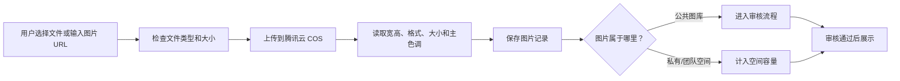
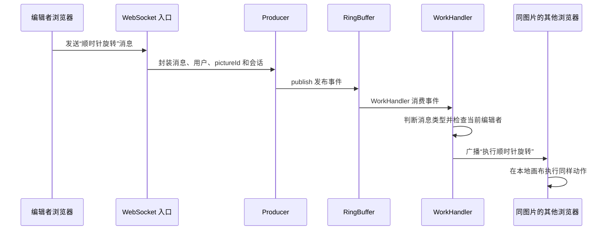
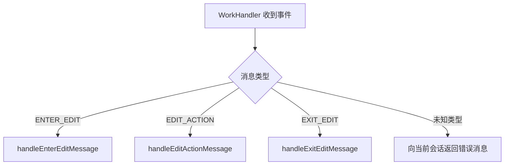
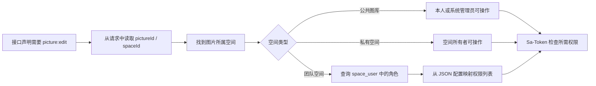
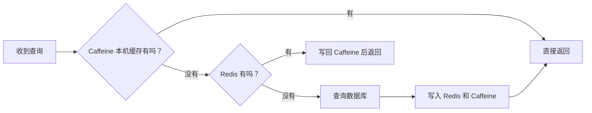

# 智识图库页面与技术流程说明

> 这份文档用尽量少的专业术语，解释作品页中出现的技术概念。可以把它当作项目讲解稿，也可以在面试前快速复习。

## 1. 这个项目解决什么问题？

智识图库不只是一个“上传图片、查看图片”的网站，它希望解决团队管理图片素材时遇到的几个问题：

1. 图片散落在不同成员电脑里，查找和复用困难。
2. 不同成员能做的操作不同，需要区分查看者、编辑者和管理员。
3. 多个人查看或编辑同一张图片时，希望及时看到其他人的状态和操作。
4. 图片数量变多以后，需要按分类、标签、颜色等方式快速检索。
5. 管理员需要知道空间用了多少容量、谁上传得最多、哪些素材最常见。

因此，项目围绕“图片空间”组织功能：公共图库用于公开浏览和审核，私有空间用于个人管理，团队空间用于成员协作。

## 2. 页面中的数据是不是真实数据？

作品页中的三张界面截图来自项目原有 Vue + Ant Design Vue 业务前端的实际运行页面。由于截图时后端服务未启动，Playwright 在浏览器侧为接口提供了本地测试数据，例如图片列表、70 MB 空间用量和 128 张图片。

- 页面组件、路由、样式和交互都使用原项目代码，没有另做一套截图页面。
- 只有接口返回内容是测试数据；人名、图片数量、容量和趋势不代表线上真实业务指标。
- 三张图分别展示团队空间列表、空间分析页，以及进入协同状态后的图片裁切弹窗。

## 3. 一张图片的基本处理流程



腾讯云 COS 可以理解为“专门存放文件的云硬盘”。数据库主要保存图片名称、地址、宽高、标签、所属空间等信息，图片文件本身放在 COS 中。

项目把“文件上传”和“URL 上传”的共同步骤放进上传模板中。两种上传方式只负责各自不同的文件获取过程，后续校验、存储和信息提取复用同一套流程。

## 4. 实时协作整体流程

作品页中最容易让人困惑的是下面这条链路：

> WebSocket → Producer → RingBuffer → WorkHandler → 广播

可以把它想象成餐厅点单：

- **WebSocket** 是服务员与后厨之间一直保持畅通的对讲机。
- **Producer** 是负责把订单放到取餐台的人。
- **RingBuffer** 是一个按顺序摆放订单的环形取餐台。
- **WorkHandler** 是从取餐台取走订单并处理的后厨员工。
- **广播** 是处理完成后通知同桌的其他人发生了什么。

### 4.1 完整链路



### 4.2 为什么使用 WebSocket？

普通 HTTP 通常是“浏览器问一次，服务器答一次”。如果浏览器想知道有没有其他人的新操作，就需要反复询问服务器。

WebSocket 建立连接后不会马上断开，服务器可以主动向浏览器推送消息。因此它适合：

- 多人协同编辑；
- 聊天和即时通知；
- 实时状态更新；
- 在线成员提示。

在这个项目中，连接会按照 `pictureId` 分组。同一张图片的在线用户放在同一个会话集合中，因此图片 A 的操作不会发送给正在查看图片 B 的用户。

## 5. “发布到 RingBuffer”是什么意思？

### 5.1 先理解“事件”

用户执行一次操作后，后端会把这次操作整理成一条事件。事件中包含：

- 执行了什么操作；
- 操作用户是谁；
- 操作的是哪张图片；
- 消息来自哪个 WebSocket 会话。

例如：

```text
图片：10086
用户：黄继祥
消息类型：EDIT_ACTION
具体动作：ROTATE_RIGHT
```

### 5.2 RingBuffer 是什么？

RingBuffer 可以理解为一个“首尾相接的环形队列”。生产者把事件放进去，消费者按顺序取出处理。

普通写法可以在 WebSocket 收到消息后立刻完成所有判断和广播，但操作较多时，网络入口会同时承担接收、判断和发送等工作。引入队列后，入口先把任务交出去，由专门的处理器继续执行。

### 5.3 发布过程做了什么？

源码中的发布过程可以翻译成下面几步：

1. 从 Disruptor 中取得 RingBuffer。
2. 调用 `next()` 申请一个可以写入事件的位置。
3. 调用 `get(next)` 取得这个位置对应的事件对象。
4. 把消息、用户、图片 ID 和 WebSocket 会话填入事件。
5. 调用 `publish(next)`，表示“这条事件已经准备好，可以交给消费者处理”。

“发布”不是把消息发送到互联网，而是把事件正式交给当前服务内部的事件队列。

## 6. Producer → WorkHandler 是什么意思？

这是一种生产者—消费者分工：

| 角色 | 项目中的类 | 负责什么 |
|---|---|---|
| Producer（生产者） | `PictureEditEventProducer` | 接收已经解析好的操作，把它放入 RingBuffer |
| RingBuffer（事件队列） | Disruptor 提供 | 临时保存并按顺序传递事件 |
| WorkHandler（消费者） | `PictureEditEventWorkHandler` | 取出事件，根据消息类型调用不同处理方法 |
| 业务处理器 | `PictureEditHandler` | 管理编辑状态，并向其他在线用户广播结果 |

这样分工的好处是：

- WebSocket 入口逻辑更简单；
- 接收消息和处理消息相互解耦；
- 后续增加新的处理逻辑时更容易扩展；
- 短时间出现较多消息时，可以先按顺序进入队列。

它并不代表系统一定能无限承受高并发，真实容量仍需要压测验证。

## 7. 三类消息如何统一分发？

系统将协同消息分成三类：

### 7.1 `ENTER_EDIT`：申请进入编辑状态

用户点击“开始编辑”时发送。

后端会检查这张图片当前是否已经有人编辑：

- 没有人编辑：记录当前用户为编辑者，并通知其他在线成员。
- 已经有人编辑：当前用户不能同时成为编辑者。

这个设计更接近“单人操作、多人观看”，可以避免两个人同时旋转或裁剪造成冲突。

### 7.2 `EDIT_ACTION`：执行具体编辑动作

表示用户执行了旋转、缩放等动作。

后端首先确认消息发送者确实是当前编辑者，然后把动作广播给同一张图片的其他在线用户。其他用户前端收到消息后，在自己的画布中执行相同动作。

### 7.3 `EXIT_EDIT`：退出编辑状态

用户主动完成编辑或 WebSocket 连接断开时触发。

后端会清除该图片的当前编辑者，并通知其他用户“编辑已结束”，之后其他成员就能申请编辑。

### 7.4 WorkHandler 如何分发？



“统一消费分发”就是所有协同事件都先进入同一个 WorkHandler，再由它根据类型选择真正的处理方法。

## 8. 为什么广播时排除当前客户端？

假设用户 A 在自己的浏览器里点击了“顺时针旋转”：

1. A 的前端已经立即把图片旋转了一次。
2. 操作发送给服务器。
3. 服务器需要通知 B、C 等其他用户也旋转。

如果服务器再把同一消息发回 A，A 的前端可能再次执行旋转，导致 A 看到旋转两次，而其他人只看到一次。因此广播时排除消息来源会话。

## 9. ConcurrentHashMap 在这里做什么？

系统需要在内存中记录两类状态：

```text
pictureId -> 当前编辑者 userId
pictureId -> 正在查看该图片的 WebSocket 会话集合
```

多个 WebSocket 线程可能同时加入、退出或发送消息。`ConcurrentHashMap` 是支持并发访问的 Map，适合保存这种会被多个线程同时读写的在线状态。

连接断开时还需要：

1. 取消该用户的编辑状态；
2. 从图片会话集合中移除连接；
3. 如果集合已经为空，则移除整个图片记录；
4. 通知其他用户该成员已经离开。

## 10. 空间级 RBAC 权限如何工作？

RBAC 是“基于角色的访问控制”。项目中有三种团队角色：

| 角色 | 可以做什么 |
|---|---|
| 浏览者 viewer | 查看图片 |
| 编辑者 editor | 查看、上传、编辑、删除图片 |
| 管理员 admin | 编辑者权限 + 管理空间成员 |

### 10.1 为什么不在每个接口中写 if-else？

如果每个接口都手动判断用户、空间和角色，会产生大量重复代码，也容易漏掉检查。

项目把鉴权拆成两部分：

- Controller 使用注解声明“这个接口需要什么权限”。
- 统一鉴权组件负责找出用户在当前空间内实际拥有的权限。

### 10.2 一次鉴权的流程



前端获取空间或图片详情时也可以收到 `permissionList`，据此决定是否显示上传、编辑、删除、成员管理等按钮。隐藏按钮提升使用体验，但真正的安全校验仍必须在后端完成。

## 11. 按颜色搜索是怎么实现的？

每张图片上传后保存一个主色调，例如 `#2563EB`。用户选择目标颜色后，系统执行：

1. 把目标颜色和图片颜色都转换为 RGB。
2. 把 RGB 看作三维空间中的一个点。
3. 使用欧氏距离计算两个颜色点的距离。
4. 距离越小，颜色越接近。
5. 按相似度排序，返回前 12 张图片。

它类似在地图上寻找“离目标地点最近的几个位置”，只不过地图的三个方向变成红、绿、蓝。

## 12. 以图搜图中的门面模式是什么？

以图搜图需要多个步骤：

1. 提交图片地址，得到搜索页面地址。
2. 解析页面，找到结果数据接口。
3. 请求结果接口，整理相似图片列表。

如果调用者需要自己了解每个步骤，使用会很复杂。项目使用 `ImageSearchApiFacade` 把内部步骤包装起来，对外只暴露一个搜索方法。

门面模式可以类比酒店前台：客人只告诉前台自己需要什么，不需要分别联系保洁、餐厅和维修部门。

## 13. Caffeine → Redis → 数据库是什么意思？

这是项目中保留的一条双层缓存实验路径：



- **Caffeine**：存在当前 Java 服务进程内，速度快，但多台服务器之间不共享。
- **Redis**：独立缓存服务，多台应用可以共享，但需要一次网络访问。
- **数据库**：保存最终数据，查询成本通常高于缓存。

Redis 过期时间在 5～10 分钟之间随机选择，是为了避免大量缓存同时失效、瞬间把请求全部压向数据库，这种问题通常叫“缓存雪崩”。

注意：当前代码把这个缓存接口标记为 `@Deprecated`，所以作品页只把它作为性能设计实验，不表示它是当前默认查询链路。

## 14. ShardingSphere 分片是什么？

当所有图片记录都放在同一张表中，数据量很大时可能影响查询和维护。分片的思路是按规则把数据分散到不同表中。

项目中的自定义算法根据 `spaceId` 决定目标表：

- 普通情况使用基础 `picture` 表。
- 满足分片条件的空间可以路由到 `picture_空间ID` 表。

可以把它理解为档案室按部门分柜：知道所属部门后，就能直接去对应柜子查找，不必翻遍所有档案。

当前动态分表管理器的组件注解处于关闭状态，因此它属于仓库中已经编写、但当前配置未启用的扩展能力。

## 15. 空间分析页面的数据从哪里来？

后端提供六类分析接口：

1. **用量分析**：容量使用量和图片数量。
2. **分类分析**：不同图片分类的数量与大小。
3. **标签分析**：常用标签排行。
4. **尺寸分析**：大图、中图、小图等尺寸分布。
5. **用户分析**：团队成员上传数量和容量贡献。
6. **空间排行**：不同空间之间的使用情况排行。

作品截图中的折线图、环形图、标签条形图和成员排行，分别对应这些分析能力。

## 16. 面试时可以怎样介绍实时协作？

可以使用下面这段较短的表述：

> 我使用 WebSocket 维护图片维度的长连接会话。前端的进入编辑、编辑动作和退出编辑消息进入服务端后，由 Producer 发布到 Disruptor RingBuffer，再由 WorkHandler 按消息类型统一消费分发。服务端用 ConcurrentHashMap 维护每张图片的当前编辑者和在线会话，并把编辑动作广播给除发送方外的其他客户端，从而实现单人操作、多人实时同步，同时避免重复执行和编辑冲突。

如果面试官继续追问，再依次解释：为什么使用 WebSocket、为什么排除发送方、三类消息分别做什么，以及当前实现采用单编辑者模式。

## 17. 术语速查

| 术语 | 一句话理解 |
|---|---|
| WebSocket | 浏览器和服务器保持连接，双方可以随时发送消息 |
| 事件 | 对一次操作的结构化描述 |
| Producer | 把事件放入队列的一方 |
| RingBuffer | Disruptor 使用的环形事件容器 |
| publish | 表示事件填写完成，可以交给消费者处理 |
| WorkHandler | 从队列取出事件并执行处理逻辑的消费者 |
| 广播 | 把消息发送给同一张图片上的多个在线用户 |
| RBAC | 根据用户角色决定其权限 |
| Caffeine | Java 进程内的本地缓存 |
| Redis | 多个服务可以共享的独立缓存 |
| 分片 | 按规则把大量数据分散到不同表或数据库 |
| COS | 用于保存图片文件的云对象存储 |
